# Measurements

Every number in this document comes from a data file under
[`results/data/`](results/data). [`results/tables.py`](results/tables.py)
writes every table below from those files, and
[`results/plot.py`](results/plot.py) draws every plot under
[`results/plots/`](results/plots) from them, with no other input; each plot
stands under the table that holds its data.
[`results/run_all.sh`](results/run_all.sh) runs every measurement below in
order and writes the data files; the logs go to [`results/log/`](results/log),
which git ignores. A number in the prose repeats a number of a table.

**How a cost row is measured.** A cost row is paired. One round runs each
binary once, and the order of the binaries turns over between the rounds, so a
drift of the machine - the clock, the temperature, the page cache - moves both
sides of a round together. The cell of a binary is the median of its rounds.
The cell of a comparison is the median of the per-round differences or ratios,
with a percentile bootstrap interval at 95 % beside it and, for a difference,
the p value of the sign test: the question a handful of rounds can answer is
whether the difference keeps its direction.
[`results/stats.py`](results/stats.py) computes all of it, seeded, so a table
does not move between two runs of the script. A row states how many rounds it
has, and a row of one round has no interval. The latency rows are not paired
and not averaged: a tail is a maximum and a set of quantiles, and the document
reports them as such.

The two binaries: **regions** is a julia built from the tip of the flat
tree, the tag `gc-regions-flat`; **vanilla** is a julia built from the base
commit, `8f33e09afe` (`v1.13.0-rc4`), with nothing else changed. A row that
names only one binary ran on regions. The `sha` in `context.tsv` names the
regions commit.

The machine: one Linux x86-64 host of 32 CPUs, idle for the whole run. The
kernel command line keeps CPUs 13 and 29, the two threads of one core,
tickless and free of RCU callbacks and of managed interrupts
(`nohz_full=13,29`, `rcu_nocbs=13,29`, `irqaffinity` that excludes them);
`isolcpus` is not set, because
[`tools/hil_isolation.sh`](tools/hil_isolation.sh) makes the isolated
partition at run time through cgroup v2.

The rows ran in two states. **M1, M5, M7 to M14** ran with the partition off,
so that every core of the machine takes load: the one-thread rows pinned to
CPU 29, the multi-thread rows on CPUs 24 to 31, and M13 and M14 on all 32.
**M2, M3, M4 and M6** ran inside the partition, where CPUs 13 and 29 are out
of the scheduler and only a task pinned there runs there; the latency rows
also take `SCHED_FIFO` at priority 50. The `isolated` field of `context.tsv`
reads the boot set, which stays empty while a cgroup partition holds the CPUs,
so it does not show that state. Every row runs under a timeout; a row outside
the partition also runs under a memory cap. The file
[`results/data/context.tsv`](results/data/context.tsv) records the date, the
commit, the host, the CPU, the kernel, the cores, and the scheduling class of
the run; `run_all.sh` writes it at the start of every run, a partial rerun
(`ONLY=...`) included, so the date is that of the last row that ran. The
footer of a plot names the run that produced the data of that plot: a partial
rerun redraws its own plots and leaves the others as they stand.

## M1 — Zero cost when unused

**Claim.** A julia that carries the region runtime, on a program that never
opens a window, runs the GCBenchmarks within a few percent of vanilla: six
of the nine benchmarks have an interval that crosses 1.00, one is 2 %
slower, and two run faster for a reason the prose below names.

Script [`bench/gcbench.sh`](bench/gcbench.sh); data
[`results/data/gcbench.tsv`](results/data/gcbench.tsv); plot
[`results/plots/gcbench.svg`](results/plots/gcbench.svg) (bars: the ratio
regions / vanilla per benchmark, one bar per thread count, a line at 1.0).
Eleven benchmarks: six serial on one thread, five parallel on four threads.
Both binaries run in every round, in alternating order. The table holds the
best of the rounds per binary, and the spread column is the larger of the two
binaries' (max − min) / min over the rounds: a ratio inside the spread is
noise.

<!-- table M1 -->
| benchmark | threads | vanilla (s) | regions (s) | regions / vanilla [95 %] | rounds |
| --- | --- | --- | --- | --- | --- |
| append | 1 | 1.610 | 1.624 | 1.01 [1, 1.01] | 10 |
| tree | 1 | 8.725 | 8.957 | 1.02 [1.01, 1.04] | 10 |
| strings | 1 | 18.604 | 18.538 | 1 [0.997, 1.01] | 10 |
| pollard | 1 | 0.657 | 0.659 | 1.01 [1, 1.02] | 10 |
| single_ref | 1 | 0.421 | 0.397 | 0.96 [0.914, 0.991] | 10 |
| many_refs | 1 | 1.979 | 1.816 | 0.917 [0.915, 0.921] | 10 |
| mergesort_parallel | 4 | 1.610 | 1.604 | 0.995 [0.99, 1] | 10 |
| mm_divide_and_conquer | 4 | 0.799 | 0.793 | 0.996 [0.982, 1.02] | 10 |
| issue-52937 | 4 | 9.832 | 9.847 | 1 [0.996, 1.01] | 10 |
<!-- /table -->

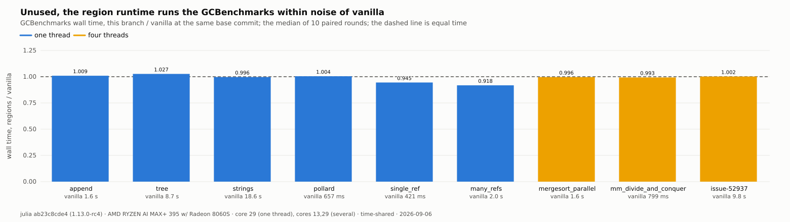

Two of the five parallel benchmarks, `tree_mutable` and `objarray`, have no
row. On this machine both abort on both binaries, in the suite's own
memory-pressure guard (`gc_cb_on_pressure` in `util/utils.jl` stops a run
after three pressure callbacks in ten seconds). The abort is a property of
the benchmark on this machine, not of either binary.

Read the intervals, not the word "noise". Six of the nine benchmarks sit
between 0.995 and 1.01 with intervals that cross 1.00, which is what "no
cost" looks like. One benchmark is above it: `tree`, at 1.02 with an
interval of [1.01, 1.04] over ten rounds, so the region runtime costs that
benchmark about 2 %. Two run faster on regions, and their intervals exclude
1.00: `single_ref` at 0.96 and `many_refs` at 0.917.

`many_refs` runs faster on regions in every round. The cause is a stock-path
change of this branch, not a region: the benchmark fills its array under
`GC.enable(false)`, and a deferred collection on vanilla re-arms its trigger
at zero, so vanilla re-enters `jl_gc_collect` on every allocation of that
phase. This branch re-arms `heap_target` (`gc_defer_collection`; see
[`HISTORY.md`](HISTORY.md), stock-path change S1).

## M2 — Unit costs

**Claim.** On a program that never opens a window, a pointer store pays one
flag load and a predicted branch (about 0.09 ns), a pool allocation pays the
active-pool indirection and the region test of `maybe_collect` (about
0.3 ns), an object constructed with boxed children pays one flag check for
all of them, and a serial stock mark pays 1.7 %. An object with two pointer
fields and two fresh children pays the three allocations, not a barrier.
With a window open, an armed store pays one page-map walk in a
cold call, a window pair and a reset cost tens of nanoseconds, and an
allocation in a region costs what an allocation in the stock pool costs in
the same process. The costs are small; they are not zero.

Script [`bench/unit_costs.jl`](bench/unit_costs.jl); data
[`results/data/unit_costs.tsv`](results/data/unit_costs.tsv); plot
[`results/plots/unit_costs.svg`](results/plots/unit_costs.svg). Each row is
the minimum over eight compiled copies of the loop, so that code placement
does not decide the row, and the minimum of five runs. Three columns:
**vanilla** holds the rows that need no region entry point, on the vanilla
binary; **regions, no window** holds the same rows on the regions binary, in a
process that never opens a window;
**regions** holds every row in one process. The store barrier arms at the
first window and stays armed, so in the third column the rows that run
after `window_pair` pay the armed store: `construct_two` writes three
pointers per object, `alloc_stock` one. The second column against the first
is what a program that never opens a window pays. The `construct_two` row
there is the largest of these costs, and it is three allocations: the loop
allocates two `Ref`s and one `Two` per object, and each pays the allocation
cost of the `alloc_stock` row. The construction itself pays the region check
alone. Vanilla emits no write barrier for the two children stored at
construction, because a fresh object is young; this branch emits the region
guard for them through `julia.region_write_barrier`, one flag load and one
branch per object, and no generational part. The `construct_shared` row
isolates it: the same `Two` with two children that already exist, so one
allocation and one construction per object. The `reset_slice` row times one
call between two clock reads, and the pair of reads costs about 10 ns on
this host: the row is an upper bound on the reset.

The `box_twin` row is the fresh-object copy: an immutable value with two
pointer fields, boxed once per object, which the runtime copies field by
field under the region check. The delta column, "no window minus vanilla",
is what a program that never opens a window pays, and its interval is what
ten paired rounds support:

- a pointer store +0.085 ns [0.084, 0.086];
- a pool allocation +0.283 ns [0.277, 0.291];
- a construction from two shared children +0.335 ns [0.320, 0.351], which
  is one allocation and one flag check;
- a boxed copy of an inline value with two pointer fields +0.243 ns
  [0.220, 0.266], which is smaller than the allocation delta: the check of
  the copied fields does not show above it;
- a construction of three allocations +0.823 ns [0.767, 0.860]. Three times
  the allocation delta is +0.849 ns, so this row is its three allocations
  and nothing else, which is what the row was built to show;
- a serial stock mark +1.14 ms [0.89, 1.43], which is 1.7 %.

Every one of those keeps its direction in 24 or 25 of the 25 rounds. The
mark row needed them: at ten rounds its sign test read 0.021 and the
interval reached from 0.42 to 1.23 ms, so ten rounds did not settle a row
that twenty-five settles. A serial mark is also the wrong place to read
this cost; M13 measures the collection at the thread counts a program uses,
and there the cost is larger.

<!-- table M2 -->
| cost | unit | vanilla | regions, no window | regions | no window − vanilla [95 %] | rounds |
| --- | --- | --- | --- | --- | --- | --- |
| store_disarmed | ns/store | 0.3212 [0.3208, 0.3225] | 0.4063 [0.4062, 0.4067] | 0.4065 [0.4062, 0.407] | 0.0851 [0.0842, 0.0856], sign 6e-08 | 25 |
| store_armed | ns/store | — | — | 1.44 [1.439, 1.44] | — | 25 |
| store_region | ns/store | — | — | 1.994 [1.993, 1.995] | — | 25 |
| window_pair | ns/pair | — | — | 10.9 [10.9, 10.9] | — | 25 |
| switch_pair | ns/pair | — | — | 5.948 [5.947, 5.95] | — | 25 |
| construct_two | ns/object | 7.013 [6.995, 7.033] | 7.823 [7.753, 7.896] | 10.4 [10.29, 10.43] | 0.823 [0.767, 0.86], sign 6e-08 | 25 |
| construct_shared | ns/object | 3.597 [3.585, 3.613] | 3.934 [3.921, 3.952] | 6.219 [6.192, 6.239] | 0.335 [0.32, 0.351], sign 6e-08 | 25 |
| box_twin | ns/object | 3.9 [3.885, 3.918] | 4.14 [4.117, 4.163] | 6.357 [6.345, 6.388] | 0.243 [0.22, 0.266], sign 6e-08 | 25 |
| alloc_stock | ns/object | 2.148 [2.145, 2.155] | 2.432 [2.427, 2.439] | 3.428 [3.41, 3.492] | 0.283 [0.277, 0.291], sign 6e-08 | 25 |
| alloc_region | ns/object | — | — | 3.98 [3.977, 3.982] | — | 25 |
| reset_slice | ns/reset | — | — | 30 [30, 30] | — | 25 |
| stock_mark | ms/collection | 65.56 [65.38, 65.73] | 66.75 [66.44, 67.24] | 66.8 [66.58, 67.22] | 1.14 [0.89, 1.43], sign 1.9e-05 | 25 |
<!-- /table -->

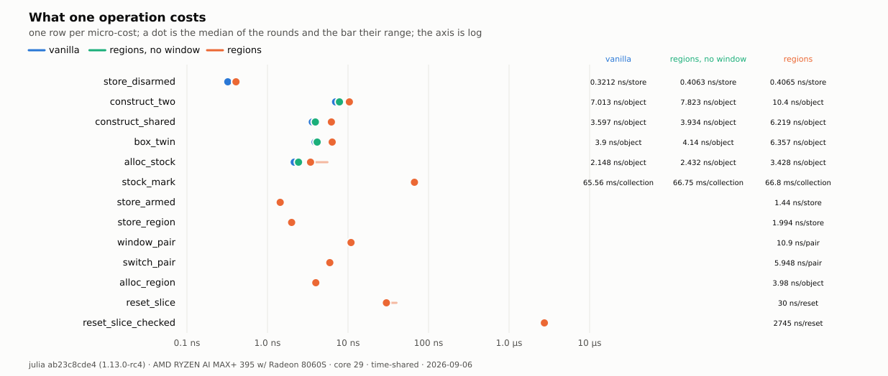

## M3 — The tail, one Bool apart

**Claim.** In a pooled event loop whose only garbage is the scratch of the
sink, the reset of the Event region after each event removes the collector's
tail from the per-event latency; the two runs differ in one Bool.

Scripts [`bench/yardstick.jl`](bench/yardstick.jl),
[`bench/tail.jl`](bench/tail.jl); data
[`results/data/tail.tsv`](results/data/tail.tsv); plot
[`results/plots/tail.svg`](results/plots/tail.svg). The yardstick rows give
the allocating and the pooled model under the stock collector; the tail rows
give the pooled model with the scratch left to the collector (`baseline`) and
reset per event (`regions`).

<!-- table M3 -->
| script | variant | p50 (ns) | p99 (ns) | p99.9 (ns) | p99.99 (ns) | max (ns) | over 100 µs | collections | GC (ms) | peak RSS (MB) |
| --- | --- | --- | --- | --- | --- | --- | --- | --- | --- | --- |
| yardstick | alloc | 60 | 81 | 581 | 892 | 14,022,596 | 24 | 12 | 17.2 | 1,029 |
| yardstick | pooled | 60 | 71 | 91 | 1,834 | 328,259 | 9 | 0 | 0.0 | 836 |
| tail | baseline | 60 | 71 | 490 | 1,483 | 2,779,265 | 29 | 16 | 10.3 | 891 |
| tail | regions | 61 | 101 | 110 | 1,363 | 328,340 | 6 | 0 | 0.0 | 976 |
<!-- /table -->

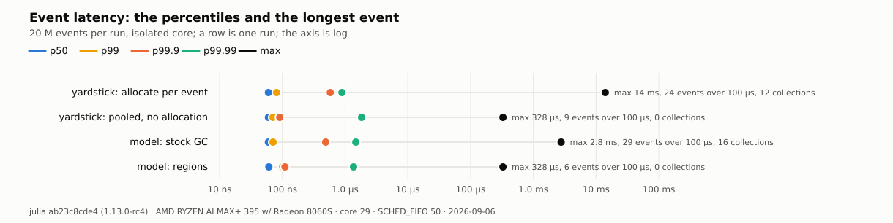

The `over 100 µs` column of a run with zero collections is not the
collector. The pooled yardstick collects nothing and still has events over
100 µs; `tail regions` collects nothing and has six. The maximum of a run
with zero collections moves between runs: an earlier run of `tail regions`
had a maximum of 34 µs and no event over 100 µs. These scripts take no heap
reserve, so the first touch of a fresh page is a page fault of the machine,
and on this host a fault on a transparent huge page takes about 200 µs. M4
takes the reserve (`jl_gc_heap_reserve`) and counts the faults: its regions
rows have zero page faults and a maximum under the slot. The claim of M3 is
the `collections`, `GC (ms)`, and `max` columns of the two `tail` rows: the
collector's tail is gone, and the remaining maximum is the machine's.

The `peak RSS` of `tail regions` is above `tail baseline`. The regions run
never collects, so the stock garbage that the harness makes outside the
window stays until the first stock collection, which the run never reaches.

## M4 — The real-world loop

**Claim.** In an event loop that allocates per event, one window per slice
and one reset per slice, with a census at the slice boundary, give a lower
and flatter latency distribution than the stock collector under its own
heuristics or under the program's schedule, at both garbage classes.

Script [`results/realworld.sh`](results/realworld.sh); data
[`results/data/realworld.tsv`](results/data/realworld.tsv) and
`results/data/ccdf_*.tsv`; plots
[`results/plots/latency_ccdf.svg`](results/plots/latency_ccdf.svg) (the
complementary cumulative distribution of the per-event latency, one panel per
garbage class, one curve per collector mode) and
[`results/plots/max_pause.svg`](results/plots/max_pause.svg) (the maximum
pause per mode, raw and with the preempted blocks removed). Four modes: stock
with its own heuristics, stock on the program's schedule, regions with the
census, regions without it. Two garbage classes: recording class (about 1.7 KB
per event) and light (about 100 bytes). Each configuration runs up to five
times, and the run with the fewest involuntary context switches is kept. The
page-fault line of every kept run must read 0.

<!-- table M4 -->
| class | mode | events/s | p50 (ns) | p99 (ns) | p99.99 (ns) | max (ns) | max, no preemption (ns) | stock collections | peak RSS (MB) |
| --- | --- | --- | --- | --- | --- | --- | --- | --- | --- |
| recording, W=200 | stock, own heuristics | 6.8 M | 60 | 381 | 641 | 3,961,056 | 3,961,056 | 316 | 1,247 |
| recording, W=200 | stock, program schedule | 6.9 M | 60 | 380 | 641 | 3,547,095 | 3,547,095 | 338 | 1,247 |
| recording, W=200 | regions, census | 14.1 M | 50 | 80 | 181 | 52,870 | 52,870 | — | 1,207 |
| recording, W=200 | regions, no census | 14.3 M | 50 | 80 | 321 | 14,337 | 14,337 | — | 1,207 |
| light, W=3 | stock, own heuristics | 16.8 M | 31 | 50 | 271 | 3,970,674 | 3,970,674 | 35 | 1,247 |
| light, W=3 | stock, program schedule | 16.2 M | 40 | 50 | 191 | 3,729,098 | 3,729,098 | 51 | 1,247 |
| light, W=3 | regions, census | 15.3 M | 41 | 51 | 110 | 44,624 | 44,624 | — | 1,207 |
| light, W=3 | regions, no census | 15.9 M | 40 | 51 | 271 | 10,450 | 10,450 | — | 1,207 |
<!-- /table -->

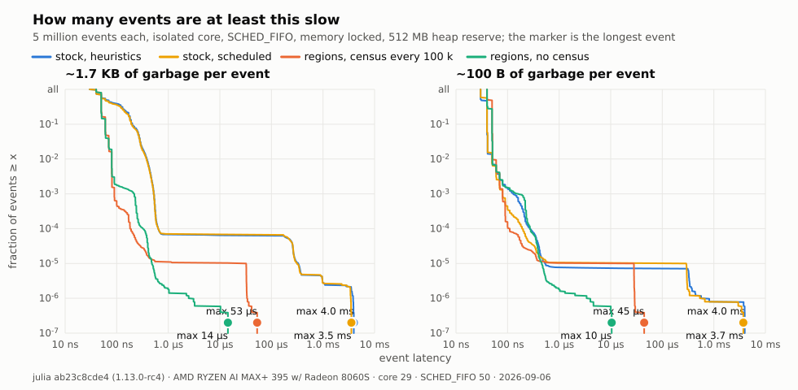

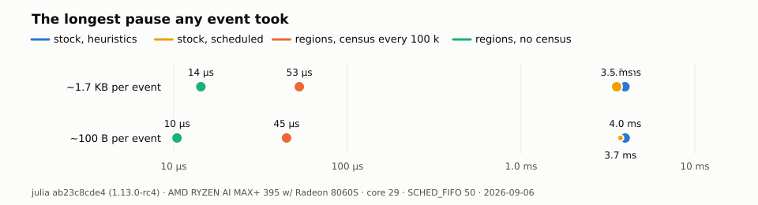

## M5 — The census

**Claim.** The pause of a census grows with the live set of the region, not
with the garbage, and stays below a full stock collection over the same
heap. One window and one reset per B events cost more than the stock
collector's amortized work when B is 1 and the scratch is light, and less
than it when B is 100 or more, at both scratch sizes.

Script [`bench/census.jl`](bench/census.jl); data
[`results/data/census_pause.tsv`](results/data/census_pause.tsv) and
[`results/data/census_throughput.tsv`](results/data/census_throughput.tsv);
plots [`results/plots/census_pause.svg`](results/plots/census_pause.svg)
(line: the pause against the live set K, scoped census and cooperative census
against a full collection) and
[`results/plots/census_throughput.svg`](results/plots/census_throughput.svg)
(bars: events per second of the stock collector, of one window per B events at
each B, and of one window per event with a census, per garbage size W).

The model is a table of K live records in the Simulation region with
turnover: every event replaces one record, so the old record is garbage in
the region, and each collection finds about 100 000 dead cells. The pause
table: `scoped` collects the Simulation region alone with the world stopped
(`jl_gc_region_collect`), `coop` is the cooperative census that marks on the
thread that owns the region (`jl_gc_region_collect_coop`), `full` keeps the
records in the ordinary heap and runs `GC.gc()`. The stop-the-world, mark,
and sweep columns are means over the collections of one run.

<!-- table M5-pause -->
| variant | K | pause p50 (µs) | pause max (µs) | stop the world (µs) | mark (µs) | sweep (µs) | live cells | freed cells |
| --- | --- | --- | --- | --- | --- | --- | --- | --- |
| scoped | 300 | 6.1 | 46.5 | 3.3 | 2.8 | 1.0 | 302 | 100,515 |
| coop | 300 | 2.6 | 17.3 | 0.1 | 2.3 | 1.0 | 302 | 100,515 |
| full | 300 | 2242.0 | 5933.8 | — | — | — | — | — |
| scoped | 1,000 | 7.1 | 41.4 | 2.9 | 3.8 | 1.2 | 1,002 | 100,550 |
| coop | 1,000 | 4.1 | 17.9 | 0.0 | 3.5 | 1.2 | 1,002 | 100,550 |
| full | 1,000 | 2301.4 | 6287.6 | — | — | — | — | — |
| scoped | 3,000 | 15.8 | 54.2 | 4.2 | 11.6 | 2.4 | 3,002 | 100,650 |
| coop | 3,000 | 9.6 | 22.6 | 0.1 | 8.2 | 2.0 | 3,002 | 100,650 |
| full | 3,000 | 2699.8 | 6096.8 | — | — | — | — | — |
| scoped | 10,000 | 35.9 | 67.8 | 3.2 | 29.3 | 4.5 | 10,002 | 101,000 |
| coop | 10,000 | 28.4 | 41.8 | 0.1 | 24.6 | 4.5 | 10,002 | 101,000 |
| full | 10,000 | 2607.0 | 6032.0 | — | — | — | — | — |
| scoped | 30,000 | 95.2 | 143.5 | 3.2 | 80.7 | 12.7 | 30,002 | 102,000 |
| coop | 30,000 | 94.1 | 123.3 | 0.0 | 82.7 | 13.3 | 30,002 | 102,000 |
| full | 30,000 | 3577.1 | 6925.8 | — | — | — | — | — |
| scoped | 100,000 | 327.6 | 373.4 | 3.0 | 278.9 | 45.4 | 100,002 | 105,500 |
| coop | 100,000 | 280.3 | 447.9 | 0.1 | 240.1 | 50.3 | 100,002 | 105,500 |
| full | 100,000 | 6076.1 | 11308.8 | — | — | — | — | — |
<!-- /table -->

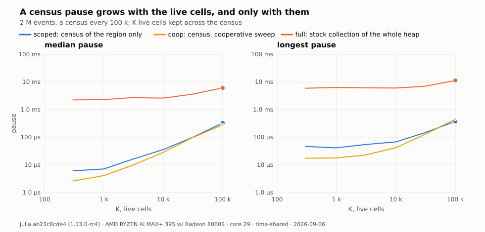

The throughput table uses the in-place handler: scratch of W floats per
event, and a record updated in place, so the Simulation region makes no
garbage. `batch` opens one Event window per B events and resets it at the
end of the B events, with no census; `autopool` is the same handler under
the stock collector; `pooled` opens and resets a window per event and runs a
scoped collection every 100 000 events, which finds nothing. B is the knob:
the window pair and the reset are paid once per B events.

<!-- table M5-throughput -->
| variant | W | B | events/s | collections | peak RSS (MB) |
| --- | --- | --- | --- | --- | --- |
| autopool | 3 | 1 | 51.2 M | 0 | 629 |
| batch | 3 | 1 | 24.2 M | 0 | 629 |
| batch | 3 | 100 | 53.5 M | 0 | 629 |
| batch | 3 | 1000 | 54.6 M | 0 | 629 |
| pooled | 3 | 1 | 22.5 M | 50 | 630 |
| autopool | 200 | 1 | 12.8 M | 0 | 630 |
| batch | 200 | 1 | 20.2 M | 0 | 630 |
| batch | 200 | 100 | 41.1 M | 0 | 629 |
| batch | 200 | 1000 | 36.3 M | 0 | 629 |
| pooled | 200 | 1 | 23.2 M | 50 | 629 |
<!-- /table -->

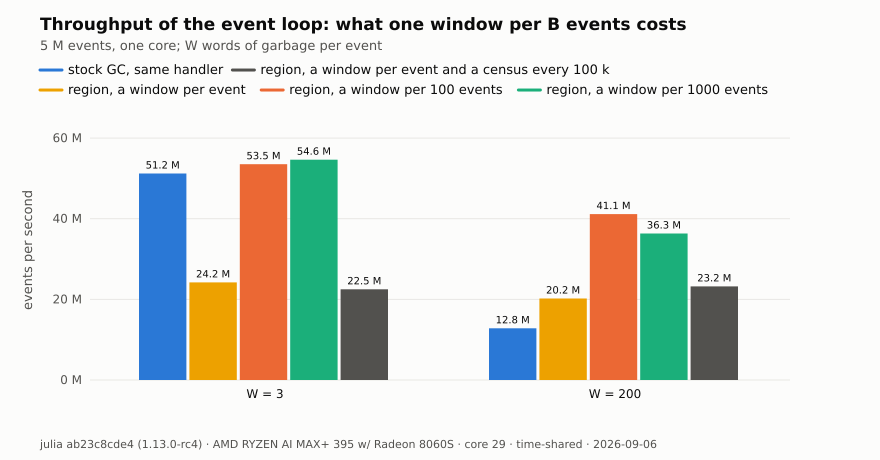

## M6 — Paced and endurance

**Claim.** At one event per 100 µs on the wall clock, the regions run misses
no slot, where the baseline under the stock collector misses slots at every
collection; over 30 minutes the RSS of the regions run stays flat.

Scripts [`bench/paced.jl`](bench/paced.jl),
[`bench/endurance.jl`](bench/endurance.jl); data
[`results/data/paced.tsv`](results/data/paced.tsv) and
[`results/data/endurance.tsv`](results/data/endurance.tsv); plots
[`results/plots/paced.svg`](results/plots/paced.svg) (dots: the latency p50,
p99.9 and max and the lateness max of each run, on one log axis) and
[`results/plots/endurance.svg`](results/plots/endurance.svg) (line: RSS and
the live-heap counter over 30 minutes).

A slot is 100 µs; a miss is an event whose lateness passes the slot. The
`baseline` runs with `--heap-size-hint=128M`, so the stock collector runs
at all in a one-million-event run; `regions` resets the Event region after
each event. The two collections of the baseline are its 105 misses: a
collection of about 5 ms holds the loop through about fifty slots, and each
event that waited past its slot is a miss. The regions run collects nothing
and misses nothing. Its `lateness max` is 5.6 µs where its `latency max` is
5.5 µs: the loop woke late once, by a tenth of a microsecond, on an event
that then ran in 5.5 µs. That is the machine, not the collector, and it
stayed far inside the slot.

<!-- table M6-paced -->
| variant | events | latency p50 (ns) | latency max (ns) | lateness p99.9 (ns) | lateness max (ns) | slot misses | GC events | GC (ms) |
| --- | --- | --- | --- | --- | --- | --- | --- | --- |
| baseline | 1,000,000 | 70 | 5,149,068 | 975 | 5,149,109 | 105 | 2 | 9.6 |
| regions | 1,000,000 | 70 | 5,530 | 241 | 5,588 | 0 | 0 | 0.0 |
<!-- /table -->

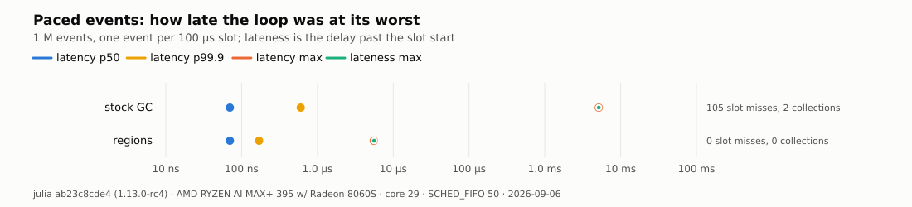

The endurance run keeps no per-event buffer: latencies go to a fixed
histogram, so the harness cannot grow, and any RSS growth is a leak. The
RSS is `Sys.maxrss`, the high-water mark. The row "allocated through the
region" is the growth of `Base.gc_live_bytes()`: that counter counts a
region allocation in and a reset never subtracts it, so its slope is the
throughput the reset recycles, not a leak (see the devdoc, section
"Counters").

<!-- table M6-endurance -->
| endurance | value |
| --- | --- |
| samples (one per 100 000 events) | 180 |
| events | 18,000,000 |
| wall (s) | 1,800 |
| RSS at the first sample (MB) | 306.07 |
| RSS at the last sample (MB) | 306.07 |
| RSS max (MB) | 306.07 |
| allocated through the region, first to last sample (MB) | 525 |
| slot misses | 0 |
<!-- /table -->

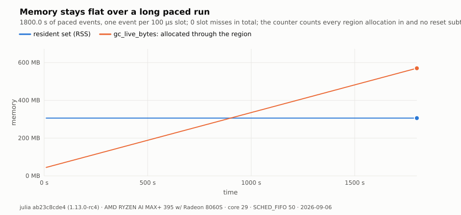

## M7 — Region-native against C++

**Claim.** A model written for regions (a packet allocated at send and
dropped at delivery, no pool) runs within a small factor of the same model
in C++ with `new` and `delete` per event, and the census keeps its memory
bounded.

Scripts [`bench/native.jl`](bench/native.jl),
[`bench/native.cpp`](bench/native.cpp); data
[`results/data/native.tsv`](results/data/native.tsv); plot
[`results/plots/native.svg`](results/plots/native.svg). The C++ row runs only
when a compiler builds `native.cpp`.

<!-- table M7 -->
| variant | W | events/s | censuses | census p50 (µs) | census max (µs) | peak RSS (MB) |
| --- | --- | --- | --- | --- | --- | --- |
| region | 3 | 58.2 M | 50 | 3.2 | 7.5 | 253.7 |
| stock | 3 | 62.7 M | — | — | — | 280.0 |
| cpp | 3 | 68.7 M | — | — | — | 3.9 |
| region | 200 | 32.2 M | 50 | 13.2 | 16.1 | 278.6 |
| stock | 200 | 31.8 M | — | — | — | 280.5 |
| cpp | 200 | 38.9 M | — | — | — | 3.8 |
<!-- /table -->

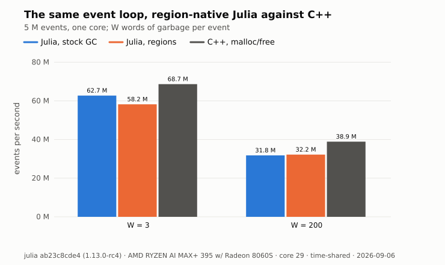

## M8 — Wholesale death

**Claim.** When a whole structure dies at once, a region reset frees it
without a collection: the binary tree, the linked list, and the tree
showcase run with zero stock collections under regions, at a peak RSS the
table shows.

Scripts [`demo/showcase_binarytree.jl`](demo/showcase_binarytree.jl),
[`demo/showcase_linkedlist.jl`](demo/showcase_linkedlist.jl),
[`demo/showcase_tree.jl`](demo/showcase_tree.jl); data
[`results/data/showcase.tsv`](results/data/showcase.tsv); plot
[`results/plots/showcase.svg`](results/plots/showcase.svg) (bars: collections
and GC time, stock against regions, per showcase; bars: peak RSS of both).
Three rounds each; the table holds the round with the best wall time.

<!-- table M8 -->
| showcase | mode | wall (s) | collections | GC (ms) | peak RSS (MB) | rounds |
| --- | --- | --- | --- | --- | --- | --- |
| binarytree | stock | 0.385 | 31 | 84.9 | 273 | 3 |
| binarytree | regions | 0.363 | 0 | 0.0 | 265 | 3 |
| linkedlist | stock | 2.204 | 10 | 1742.5 | 2,387 | 3 |
| linkedlist | regions | 0.578 | 0 | 0.0 | 2,387 | 3 |
| tree | stock | 0.008 | 6 | 0.9 | — | 3 |
| tree | regions | 0.007 | 0 | 0.0 | — | 3 |
<!-- /table -->

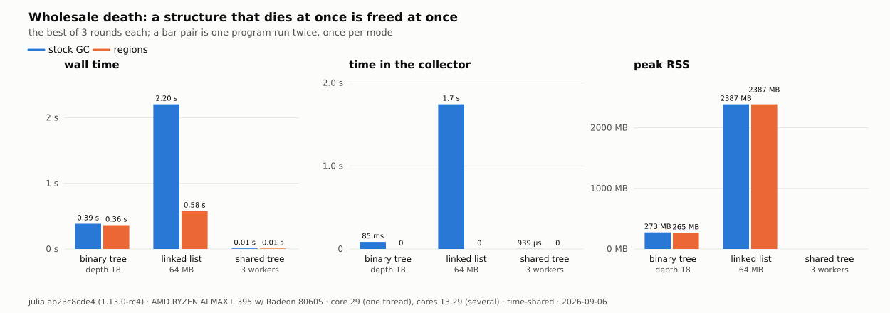

## M9 — The growth bound

**Claim.** The census of the open region, armed at a page threshold, holds
the pages of a region that churns inside one window to a bound; disarmed,
the region grows with the churn.

Script [`bench/census_bound.jl`](bench/census_bound.jl); data
[`results/data/census_bound.tsv`](results/data/census_bound.tsv); plot
[`results/plots/census_bound.svg`](results/plots/census_bound.svg) (line:
pages per round, disarmed and armed, the threshold as a horizontal line). The
test `census_growth_bound` in
[`test/gc/regions_census.jl`](../../test/gc/regions_census.jl) asserts the
bound; the benchmark prints the pages per round.

<!-- table M9 -->
| census | rounds | pages at the last round | pages max | ratio disarmed / armed |
| --- | --- | --- | --- | --- |
| disarmed | 40,000 | 10,089 | 10,089 | 1.00 |
| armed | 40,000 | 60 | 63 | 160.14 |
<!-- /table -->

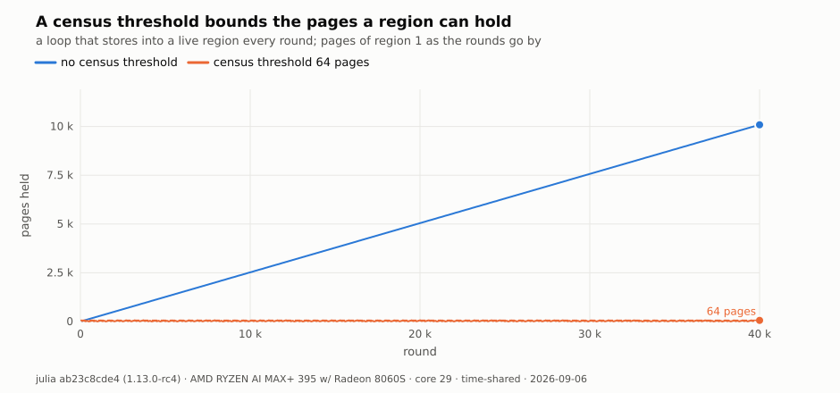

## M10 — The demonstrators

**Claim.** On four algorithms, the same code runs under regions and under
the stock collector; regions win on collections and pauses in every case,
and win on wall time where the discarded allocation per unit of work is
large. Where the region model loses on wall time, the table says so.

Scripts [`demo/bt_solver.jl`](demo/bt_solver.jl) (A),
[`demo/pathtrace.jl`](demo/pathtrace.jl) (B),
[`demo/optimistic_bst.jl`](demo/optimistic_bst.jl) (C),
[`demo/dmr.jl`](demo/dmr.jl) (D); data
[`results/data/demo_a.tsv`](results/data/demo_a.tsv) to
[`results/data/demo_d.tsv`](results/data/demo_d.tsv); plots
[`results/plots/demo_a.svg`](results/plots/demo_a.svg) to
[`results/plots/demo_d.svg`](results/plots/demo_d.svg) (wall time regions
against stock over the sweep, the stock collection count on a second axis) and
[`results/plots/demo_rss.svg`](results/plots/demo_rss.svg) (peak RSS regions
against stock, all four). A, B, C, and D run interleaved A/B/A/B. The stock
baseline is the same algorithm under the stock collector; a different
algorithm is never claimed as beaten.

The ratio column is stock / regions: above 1.0 regions are faster.

<!-- table M10 -->
| demo | point | threads | wall stock (ms) | wall regions (ms) | stock / regions | collections stock | collections regions | GC stock (ms) | GC regions (ms) | peak RSS stock (MB) | peak RSS regions (MB) |
| --- | --- | --- | --- | --- | --- | --- | --- | --- | --- | --- | --- |
| A | small (1500 instances, n=30, K=3) | 1 | 118.2 | 110.4 | 1.07 | 11 | 0 | 5.6 | 0.0 | 278 | 277 |
| A | medium (3000 instances, n=32, K=3) | 1 | 248.9 | 231.6 | 1.07 | 23 | 0 | 12.1 | 0.0 | 281 | 281 |
| A | large (5000 instances, n=34, K=3) | 1 | 437.1 | 409.5 | 1.07 | 41 | 0 | 20.4 | 0.0 | 281 | 281 |
| B | small (160x100, 8 spp, depth 8, 4 threads) | 4 | 5.5 | 6.0 | 0.92 | 0 | 0 | 0.0 | 0.0 | 284 | 284 |
| B | medium (160x100, 24 spp, depth 8, 4 threads) | 4 | 17.0 | 16.5 | 1.03 | 2 | 0 | 0.3 | 0.0 | 286 | 285 |
| B | large (160x100, 64 spp, depth 8, 4 threads) | 4 | 44.2 | 42.9 | 1.03 | 7 | 0 | 0.8 | 0.0 | 286 | 286 |
| C | work=0 (80000 keys, work=0, 4 threads) | 4 | 28.0 | 63.4 | 0.44 | 2 | 5 | 4.0 | 4.9 | 356 | 363 |
| C | work=64 (80000 keys, work=64, 4 threads) | 4 | 81.3 | 94.7 | 0.86 | 22 | 4 | 25.6 | 5.2 | 379 | 379 |
| C | work=256 (80000 keys, work=256, 4 threads) | 4 | 285.5 | 181.2 | 1.58 | 39 | 2 | 114.0 | 3.4 | 531 | 545 |
| C | work=1024 (80000 keys, work=1024, 4 threads) | 4 | 871.7 | 479.8 | 1.82 | 121 | 2 | 323.8 | 2.7 | 620 | 517 |
| D | work=0 (grid 16, work=0, 4 threads) | 4 | 36.5 | 36.2 | 1.01 | 0 | 0 | 0.0 | 0.0 | 288 | 288 |
| D | work=512 (grid 16, work=512, 4 threads) | 4 | 37.8 | 36.7 | 1.03 | 4 | 0 | 2.4 | 0.0 | 299 | 289 |
| D | work=2048 (grid 16, work=2048, 4 threads) | 4 | 46.1 | 38.2 | 1.21 | 24 | 0 | 8.2 | 0.0 | 303 | 299 |
<!-- /table -->

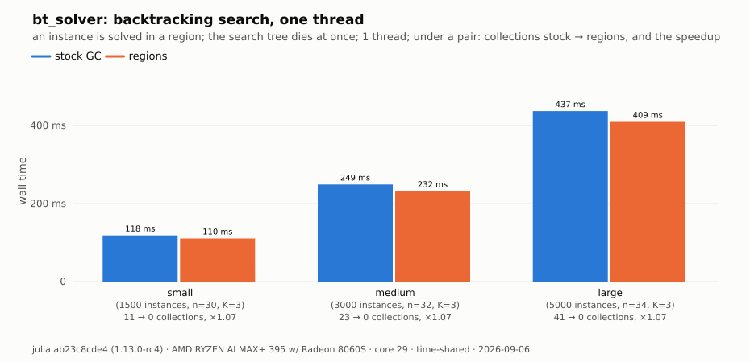

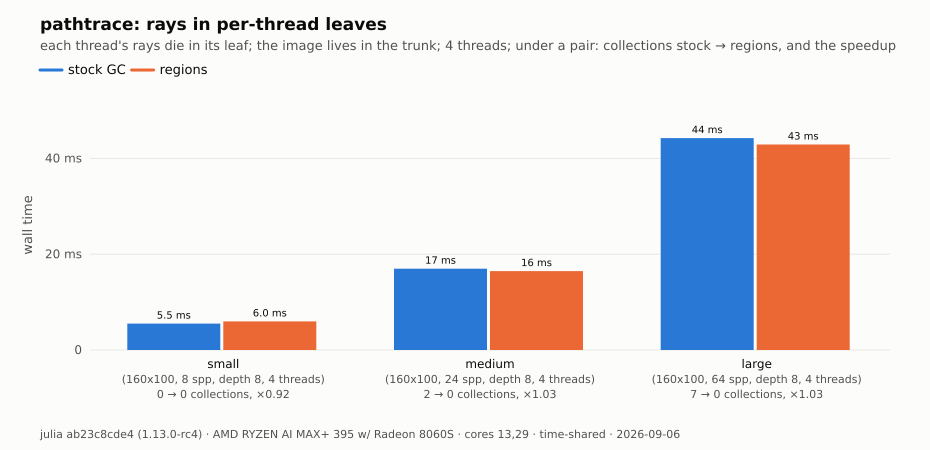

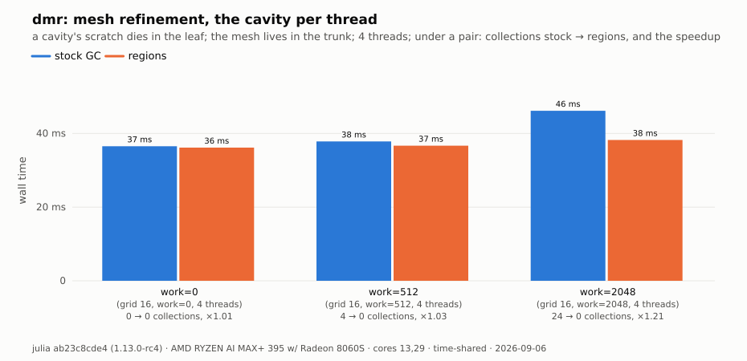

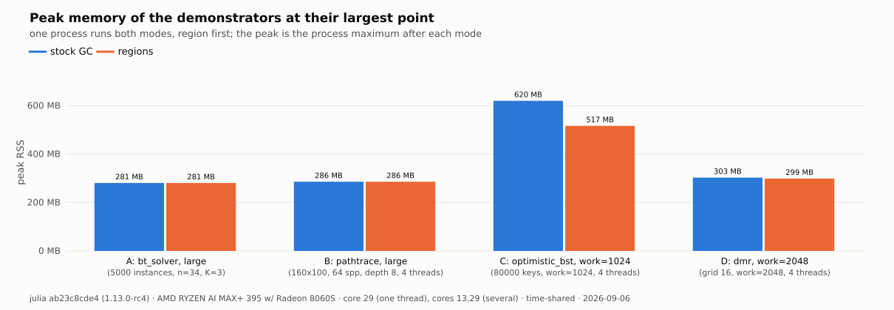

## M11 — The discipline checker

**Claim.** The checker finds the stores of the allocating model that break
the region rule, and finds none in the clean model, without a region in use.

Script [`tools/checker_run.jl`](tools/checker_run.jl) (after
[`tools/hook_patch.py`](tools/hook_patch.py)); data
[`results/data/checker.tsv`](results/data/checker.tsv); no plot.

<!-- table M11 -->
| model | events | violations (stores) | sites |
| --- | --- | --- | --- |
| alloc | 100,000 | 200,018 | 3 |
| clean | 100,000 | 0 | 0 |
<!-- /table -->

## M12 — Thread scaling of the sibling leaves

**Claim.** Sibling leaves, one per worker, scale with the thread count
without coordination between the leaves: on both demonstrators the wall
time of the regions run falls with the thread count as the stock run's
does. Where the stock collector runs during the work (D at a large work
factor), the regions run is faster at two threads and more; at one thread
the two are equal within noise.

Scripts [`demo/pathtrace.jl`](demo/pathtrace.jl) (B),
[`demo/dmr.jl`](demo/dmr.jl) (D) at 1, 2, 4, and 8 threads; data
[`results/data/scaling.tsv`](results/data/scaling.tsv); plot
[`results/plots/scaling.svg`](results/plots/scaling.svg) (line: wall time
against thread count, regions and stock, per demonstrator). This row runs on
CPUs 24 to 31. The ratio column is stock / regions.

<!-- table M12 -->
| demo | point | threads | wall stock (ms) | wall regions (ms) | stock / regions | collections stock | collections regions | GC stock (ms) | GC regions (ms) |
| --- | --- | --- | --- | --- | --- | --- | --- | --- | --- |
| B | small | 1 | 12.9 | 13.2 | 0.98 | 0 | 0 | 0.0 | 0.0 |
| B | medium | 1 | 38.6 | 38.4 | 1.01 | 2 | 0 | 0.3 | 0.0 |
| B | large | 1 | 101.8 | 100.9 | 1.01 | 6 | 0 | 0.7 | 0.0 |
| D | work=0 | 1 | 88.1 | 86.3 | 1.02 | 0 | 0 | 0.0 | 0.0 |
| D | work=512 | 1 | 91.9 | 87.6 | 1.05 | 2 | 0 | 1.6 | 0.0 |
| D | work=2048 | 1 | 90.0 | 90.7 | 0.99 | 11 | 0 | 6.4 | 0.0 |
| B | small | 2 | 10.4 | 10.7 | 0.98 | 0 | 0 | 0.0 | 0.0 |
| B | medium | 2 | 30.6 | 30.4 | 1.01 | 2 | 0 | 0.2 | 0.0 |
| B | large | 2 | 80.1 | 79.2 | 1.01 | 7 | 0 | 0.7 | 0.0 |
| D | work=0 | 2 | 58.7 | 58.1 | 1.01 | 0 | 0 | 0.0 | 0.0 |
| D | work=512 | 2 | 59.9 | 58.4 | 1.03 | 4 | 0 | 3.1 | 0.0 |
| D | work=2048 | 2 | 69.4 | 62.0 | 1.12 | 18 | 0 | 7.5 | 0.0 |
| B | small | 4 | 5.5 | 6.0 | 0.91 | 0 | 0 | 0.0 | 0.0 |
| B | medium | 4 | 16.6 | 16.9 | 0.98 | 2 | 0 | 0.3 | 0.0 |
| B | large | 4 | 43.7 | 42.8 | 1.02 | 7 | 0 | 0.8 | 0.0 |
| D | work=0 | 4 | 37.5 | 36.6 | 1.03 | 0 | 0 | 0.0 | 0.0 |
| D | work=512 | 4 | 38.9 | 37.9 | 1.03 | 5 | 0 | 3.5 | 0.0 |
| D | work=2048 | 4 | 47.5 | 39.3 | 1.21 | 24 | 0 | 9.1 | 0.0 |
| B | small | 8 | 3.4 | 3.9 | 0.86 | 0 | 0 | 0.0 | 0.0 |
| B | medium | 8 | 10.1 | 10.2 | 1.00 | 2 | 0 | 0.3 | 0.0 |
| B | large | 8 | 26.9 | 25.9 | 1.04 | 7 | 0 | 1.0 | 0.0 |
| D | work=0 | 8 | 24.9 | 24.1 | 1.03 | 1 | 0 | 1.5 | 0.0 |
| D | work=512 | 8 | 26.4 | 23.8 | 1.11 | 5 | 0 | 3.0 | 0.0 |
| D | work=2048 | 8 | 37.2 | 25.4 | 1.46 | 30 | 0 | 9.3 | 0.0 |
<!-- /table -->

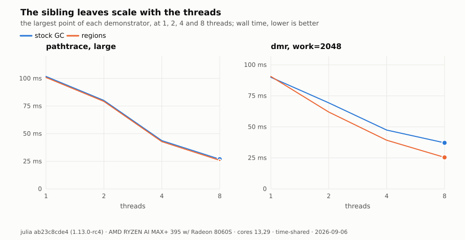

## M13 — The collector on the whole machine

**Claim.** With the region runtime unused, a parallel collection costs what
a vanilla collection costs, at every thread count a program uses.

Script [`bench/parallel_gc.jl`](bench/parallel_gc.jl); data
[`results/data/parallel_gc.tsv`](results/data/parallel_gc.tsv); plot
[`results/plots/parallel_gc.svg`](results/plots/parallel_gc.svg). The script
opens no window and calls no region entry point, so the same file runs on both
binaries. Every thread builds a part of the live set, a tree and a vector of
boxes, so every heap holds a part of it and the marking threads have work to
steal. Twelve full collections run after a warm one; every collection is a
sample, and the cell of a round is their median. A row runs at `-t T
--gcthreads=T/2`, the default ratio of julia, for the thread counts of
`GCTHREADS`.

The row exists because a serial mark cannot show what the region runtime
adds to a parallel one. The runtime adds one relaxed load per object in the
mark loops, the census filter, which every marking thread reads from one
global; one byte test per page in the sweep; and three brackets that walk 64
region entries per heap, so that part grows with the number of heaps. The
`time to safepoint` column is the longest a thread took to reach the
safepoint of a collection: it is a property of the program and the thread
count, not of the regions, and it is reported so that a large collection
time can be attributed.

<!-- table M13 -->
| threads | vanilla (ms) | regions (ms) | regions / vanilla [95 %] | mark vanilla (ms) | mark regions (ms) | time to safepoint (µs) | rounds |
| --- | --- | --- | --- | --- | --- | --- | --- |
| 1 | 39.9 [39.6, 40.1] | 40.9 [40.4, 41.5] | 1.02 [1.02, 1.03] | 35.7 [35.6, 36] | 36.8 [36.4, 37.2] | 5.65 [4.64, 6.24] | 10 |
| 4 | 56.8 [56.6, 57.2] | 58.1 [58, 58.4] | 1.02 [1.01, 1.03] | 49.2 [48.9, 49.5] | 50.6 [50.3, 50.7] | 7.89 [6.28, 8.41] | 10 |
| 8 | 59.1 [58, 60.5] | 60 [59.8, 60.9] | 1.01 [0.988, 1.04] | 49.5 [48.1, 50.7] | 49.7 [49.5, 50.4] | 6.99 [6.65, 7.33] | 10 |
| 16 | 65.7 [65.3, 68.6] | 67.6 [67.3, 69.2] | 1.03 [1.01, 1.04] | 49.6 [49.2, 52.8] | 50.8 [50.3, 52.4] | 7.29 [7.02, 7.78] | 10 |
| 32 | 83.5 [82.6, 84.4] | 88.9 [87.6, 90.1] | 1.07 [1.03, 1.08] | 58.7 [58.1, 59.4] | 62.5 [61.1, 63.7] | 8.12 [7.29, 8.49] | 10 |
<!-- /table -->

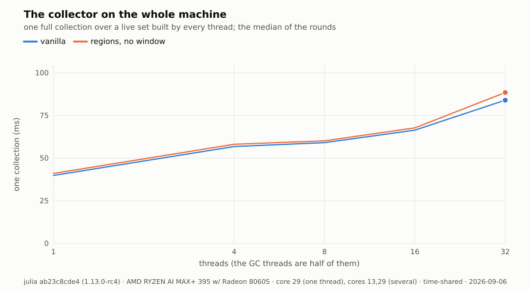

## M14 — What a reset costs the other threads

**Claim.** The checked reset stops the world, so its cost grows with the
number of threads that run Julia code; the unchecked entry does not.

Script [`bench/reset_pause.jl`](bench/reset_pause.jl); data
[`results/data/reset_pause.tsv`](results/data/reset_pause.tsv); plot
[`results/plots/reset_pause.svg`](results/plots/reset_pause.svg). `T - 1`
worker tasks do arithmetic, reach a safepoint every round, and allocate a
little; the main task fills region 1, closes the window, and times one reset.
Two columns follow from that: what the caller pays, and the longest stall a
worker suffered inside a reset interval. The unchecked entry is the control,
because it frees with no pause and no scan.

The row matters for the loop this collector is built for. A hardware loop
runs on the whole machine, and a reset that stops thirty-one other threads
is a different act from a reset that stops none. The `collections` column
counts the stock collections of the run: the workers allocate, so a stock
collection can also stall a worker, and a row whose stalls sit far above its
resets with many collections measures the collector, not the reset.

The caller pays four times more at 32 threads than alone: 26.8 µs with no
worker, 107 µs with 31. The stall a worker suffers grows faster, from 118 µs
at four threads to 533 µs at sixteen. The unchecked entry stays at a tenth
of a microsecond at every width and stalls no worker up to sixteen threads,
which is the control the checked column needs.

At 32 threads the stall column measures the machine, not the reset. The
workers, the main task and the GC threads together ask for more than the 32
cores, so a worker waits for a core whatever the reset does: the unchecked
entry shows the same 5 ms there. Read the stall column up to sixteen
threads, and read the caller column at every width.

<!-- table M14 -->
| entry | threads | workers | caller median (µs) | caller max (µs) | worst worker stall (µs) | collections | rounds |
| --- | --- | --- | --- | --- | --- | --- | --- |
| checked | 1 | 0 | 26.8 [26.7, 27] | 38 [32.5, 41.2] | — | 0 | 10 |
| checked | 4 | 3 | 35 [34.8, 35.8] | 129 [90.9, 788] | 118 [72, 345] | 0 | 10 |
| checked | 8 | 7 | 45.2 [40.4, 46.8] | 175 [114, 1.19e+03] | 187 [83.9, 583] | 0 | 10 |
| checked | 16 | 15 | 66.5 [62, 68.9] | 252 [209, 2.2e+03] | 533 [333, 1.74e+03] | 1 | 10 |
| checked | 32 | 31 | 107 [105, 109] | 3.67e+03 [3.38e+03, 5.13e+03] | 4.44e+03 [3.86e+03, 4.97e+03] | 0 | 10 |
| unsafe | 1 | 0 | 0.07 [0.06, 0.075] | 0.151 [0.145, 0.2] | — | 0 | 10 |
| unsafe | 4 | 3 | 0.071 [0.061, 0.08] | 0.365 [0.301, 0.521] | 0 [0, 497] | 0 | 10 |
| unsafe | 8 | 7 | 0.08 [0.061, 0.08] | 0.271 [0.165, 0.431] | 0 [0, 0] | 0 | 10 |
| unsafe | 16 | 15 | 0.08 [0.0755, 0.106] | 1.48 [0.961, 2.44] | 0 [0, 507] | 1 | 10 |
| unsafe | 32 | 31 | 0.13 [0.12, 0.13] | 0.441 [0.281, 1.79] | 4e+03 [3.54e+03, 5e+03] | 0 | 10 |
<!-- /table -->

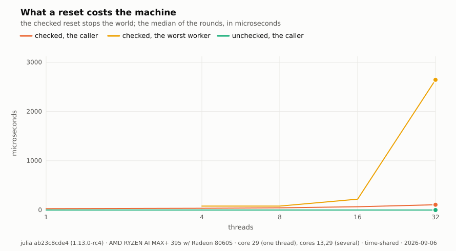
