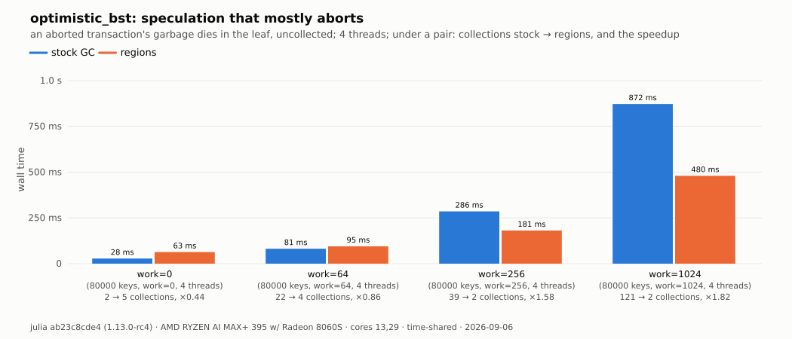

# Memory regions

A second way to free memory in Julia, beside the stock collector: allocate
the objects of one unit of work in a **region**, and free the whole region in
one act, with no mark and no sweep.

```julia
@with_region 1 begin        # everything allocated here belongs to region 1
    handle_one_event(state)
end
region_reset(1)             # every object of that unit is gone, at once
```

The stock collector still runs, still owns everything outside a region, and
never traces a region's pages. A program that opens no window pays one
predicted branch per pointer store.

## Why you might want it

The stock collector chooses when to pause. That is right for most programs
and wrong for a loop with a deadline: a discrete-event simulation that drives
hardware, a control loop, a frame, a request with a latency budget.

| The problem | What a region does |
| --- | --- |
| A pause of milliseconds arrives at a moment your loop did not choose. | You free at a moment you choose, and freeing costs the pages, not the objects. |
| You know the garbage of one unit of work dies at the end of that unit. The collector does not know it. | You say it: the unit's objects go in a region, and the reset frees them. |
| The collector's work grows with the live set it traces. | A reset traces nothing. Its cost is the pages of the region. |

What it does **not** do: it does not make a program faster in general, it
does not replace the collector, and it does not remove your duty to know what
your program allocates. Where the discarded allocation per unit of work is
small, the region model loses on wall time. The measurements show that
crossover, not only the wins.

## The model, for a program

Five ideas, and nothing else:

| Idea | What it is |
| --- | --- |
| **Region** | A number from 1 to 63. Region 0 is the ordinary heap. A region is a set of pool pages, not a type and not a container. |
| **Window** | A scope. While a window on region `n` is open, everything the **calling task** allocates lands in region `n`. |
| **Reset** | Frees every object of a region at once. It first checks that nothing on any stack points into the region, and refuses if something does. A second entry, `unsafe_region_reset`, skips that check and its stop-the-world pause: it is 30 ns against 27 µs, and a reference left behind dangles. Take it only for a loop that has shown it leaves none. |
| **The one rule** | An object in a region may reference objects of its **own region or an older one**. Region 0 is the oldest. A store that breaks the rule is caught. |
| **Lifetime tree** | The default order is `0 <- 1 <- 2 <- ...`: region 1 outlives region 2. Declare another tree, and two leaves become isolated from each other. |

**What happens if you break the rule.** The write barrier sees the store,
prints one line that names both objects, and **quarantines** the region: from
then on its reset and its censuses refuse, and its memory is retained until
the process ends. You lose the memory of that region. You never lose memory
safety, and you never get a dangling pointer.

**What you must not do.** The five that catch people:

- Do not keep a reference to a region object past the reset. The reset checks
  the stacks and refuses, so this is a refusal and not a crash.
- Do not open a window at top level. A definition inside a window makes its
  method, type or binding in the region, and the store into region 0 is an
  escape.
- Do not capture a region object in a task closure. The closure belongs to
  the scheduler, which is region 0. Pass a raw pointer or an index.
- Do not block inside a window. The window keeps the region live and pins the
  task to its thread.
- Do not hand a region object to C and let it keep the pointer. The barrier
  sees managed stores and nothing else.

## The Julia API

The face is [`regions.jl`](regions.jl), a thin `ccall` wrapper. There is no
`Base` API: `include` the file and write `using .Regions`.

**Allocate**

| Call | Does |
| --- | --- |
| `@with_region n body` | Runs `body` with region `n` current; restores the previous region however the body leaves. |
| `region_set(n) -> previous` | The raw form. `n = 0` closes the window. |
| `region_current() -> n` | The region of the open window, 0 for none. |
| `@in_region_of container body` | Allocates the body's objects **where `container` lives**, not where the window points. For a replacement buffer of a container of your own. |
| `region_of(x) -> n` | The region an object lives in. |

**Free**

| Call | Does |
| --- | --- |
| `region_reset(n) -> pages` | Runs the region's finalizers, checks the execution roots, stops the world, frees. Returns the pages freed, or a negative code. |
| `unsafe_region_reset(n)` | The same free with no check and no pause. A reference left behind dangles. |
| `region_reset_global(n)` | Frees region `n` on every thread heap at once, with the world stopped. For a region several threads filled. |
| `region_quarantined(n) -> Bool` | Has an escape quarantined this region? |

**Keep a region alive**

| Call | Does |
| --- | --- |
| `region_collect(n)` | A census: frees the dead cells of one region and keeps the live ones. Stops the world. |
| `region_collect_coop(n)` | The same, with no stop, when every other thread is parked. |
| `region_census_threshold!(pages)` | Arms the census of the open region: past `pages`, the region censuses itself. |
| `region_pages(n)` | The pages the region holds on this heap. |

**Shape and machine**

| Call | Does |
| --- | --- |
| `region_parent!(child, parent)`, `region_tree!(parents)`, `region_parent_of(child)` | Declare and read the lifetime tree, before any of the regions is used. |
| `region_reserve(bytes)` | Claims and prefaults heap before a loop starts, so the loop takes no page fault. |
| `region_check(n)`, `region_debug(on)` | The reset's root check as a query, and extra reporting. |

A refusal is a negative return code, not an exception:

| Code | Means |
| --- | --- |
| −1 `EINVAL` | A bad region number, or a build without regions. |
| −2 `EBUSY` | The region is current, a window is open, or finalizers run here. |
| −5 `EQUARANTINED` | An escape quarantined the region. |
| −6 `EFINALIZERS` | Finalizers are pending; run a census first. |
| −7 `ECHILD` | A child region is live; reset the child first. |
| −8 `EROOT` | An execution root still points into the region. |

## Examples

**1. Scratch that dies every round.** The common case.

```julia
include("contrib/memory-regions/regions.jl"); using .Regions

const SCRATCH = 1

@noinline function step!(state)          # a frame, an event, a request
    @with_region SCRATCH begin
        work = [transform(x) for x in state.input]
        state.answer = reduce(merge, work)
    end
end

for _ in 1:1_000_000
    step!(state)
    copy_out!(state)                     # take what must survive, then
    region_reset(SCRATCH)                # free the round in one act
end
```

The reset must not run in a frame that still names one of the region's
objects. A Julia frame roots a local until the frame ends, so build and use
the objects in a function and reset after it returns.

**2. Read the answer of the reset.**

```julia
r = reinterpret(Int64, region_reset(SCRATCH))
if r < 0
    r == -8 && @warn "something still points into the region"
    r == -5 && @error "an escape quarantined it; the memory is retained"
else
    @info "freed" pages=r
end
```

**3. A container of your own that grows inside a window.**

```julia
mutable struct RingBuffer
    data::Memory{Float64}
end

function grow!(rb::RingBuffer)
    new = @in_region_of rb Memory{Float64}(undef, 2 * length(rb.data))
    copyto!(new, rb.data)
    rb.data = new          # legal: the buffer lives where the container lives
end
```

Without `@in_region_of` the new buffer lands in the open window's region, an
older container holds a younger object, and the barrier quarantines the
region for an ordinary `push!`. Base does this for its own containers
already; this is the same rule for yours.

**4. One leaf per worker, over a shared trunk.**

```julia
region_parent!(2, 1); region_parent!(3, 1)      # leaves 2 and 3 under trunk 1
@with_region 1 begin
    trunk = build_shared_model()                # lives as long as the run
end
Threads.@threads :static for w in 1:2
    leaf = w + 1
    for round in 1:1000
        run_round!(leaf, pointer_from_objref(trunk))   # not the object itself
        region_reset(leaf)
    end
end
region_reset_global(1)
```

Leaves 2 and 3 are siblings: neither may reference the other, and both may
reference the trunk. A worker takes the trunk as a raw pointer, because a
task closure that captured it would be a region-0 object that holds a
region-1 reference.

**5. A region that must live on.** One unit of work can be long and make
garbage inside itself. A census reclaims the dead cells without closing the
window:

```julia
region_census_threshold!(256)   # past 256 pages the open region censuses itself
@with_region SEARCH begin
    explore(tree)               # allocates and discards inside the window
end
region_reset(SEARCH)
```

## How it works, in outline

| Mechanism | What it does | What it costs |
| --- | --- | --- |
| **The page tag** | Every pool page carries the region that claimed it. A region owns its pages, and the stock sweep skips them. | One byte in the page metadata. |
| **The window** | A window switches one pointer in the thread heap, so the allocation fast path addresses another set of pool cursors. No copying, and no parked state that can go stale. | One dependent load on every pool allocation. |
| **The barrier** | Every managed pointer store loads one flag. Before the first window, that is all it does. Armed, it compares the page tags of the parent and the child, and quarantines the child's region when the store breaks the rule. | One predicted branch per store; one page-map walk per store while a region is in use. |
| **The reset** | Runs the region's finalizers, then parks the whole page chain on the region's free list. No object is touched and nothing is traced. The checked entry adds one act before the free: it stops the world and scans the execution roots of every thread, and refuses when one points into the region. | The free is constant per page: **30 ns** for a small region through `unsafe_region_reset`. The check is what costs: **27 µs** with no other thread and **107 µs** with 31 workers, because a stop of the world grows with the threads that must reach a safepoint. |
| **The census** | Marks from the execution roots with a filter that claims only objects of the region, then sweeps only that region's pages. | Proportional to the live set of the region, not of the heap. |
| **The tree** | Each region carries a bitset of its ancestors, so the barrier's test is one shift and one bit test. | Nothing per object. |

The stock collector does what it did: it traces its own heap, it walks the
region objects it meets and leaves them where they are, and it frees the
stock objects a region references when nothing else holds them.

## What it buys, and what it costs

Short form. Every number has a table in [`MEASUREMENTS.md`](MEASUREMENTS.md),
and every cost is broken down in [`COST.md`](COST.md).

**Buys**

| Claim | Number |
| --- | --- |
| The collector's tail leaves a paced loop | At one event per 100 µs slot the regions run misses no slot in a million; the stock run misses at every collection (M6). |
| A long pause becomes a short one | On a 5-million-event loop with 1.7 KB of garbage per event: 3.96 ms longest pause under the stock collector, 14 µs with regions and no census, 53 µs with one (M4). |
| Wholesale death is free | A structure that dies at once frees with zero collections; the linked-list showcase runs 3.8x faster (M8). |
| Where the garbage per unit of work is large, wall time wins too | Up to 2x on the demonstrators — and the same demonstrators lose at 0.44x when the unit of work is small (M10). |

**Costs, for a program that never opens a window**

| Cost | Number |
| --- | --- |
| A pointer store | +0.085 ns [0.084, 0.086] |
| A pool allocation | +0.283 ns [0.277, 0.291] |
| A serial stock mark | +1.7 % |
| A full collection on 32 threads | +7 % [3 %, 8 %] |
| The GCBenchmarks suite | Six of nine benchmarks within noise of vanilla, one 2 % slower, two faster (M1) |
| The system image | +3.4 % of its text |

The last cost is the largest and the least attributable. Six probe builds
show it is not the store barrier, not the region allocator and not the census
filter, but the collector's own region checks, each too small to separate.
[`COST.md`](COST.md) carries the attribution and the four candidate fixes
that were built and rejected.

The two sides of one claim in one plot: demonstrator C, a speculative tree
whose aborted transactions die in a leaf. With little work per transaction
the region model loses; as the garbage per unit of work grows, the stock
collector's count of collections grows and the region model wins.



## Where things are

| Document | Holds |
| --- | --- |
| [`doc/src/devdocs/gc-regions.md`](../../doc/src/devdocs/gc-regions.md) | The design: the model, the six rules, the barrier, the API with its return codes, the tree, the census, the limits. |
| [`MEASUREMENTS.md`](MEASUREMENTS.md) | Every measurement: the claim, the script, the data, the plot, the numbers. Fourteen rows, M1 to M14. |
| [`COST.md`](COST.md) | What a program that opens no window pays, in absolute and relative numbers, with a judgment of each row. |
| [`HISTORY.md`](HISTORY.md) | How it came to be: the plans, the ideas that were dropped, the bugs and their tests, what the measurements changed. |

| Path | Content |
| --- | --- |
| [`regions.jl`](regions.jl) | The Julia face. Every benchmark and demonstrator includes it. |
| [`bench/`](bench) | The benchmarks. [`bench/README.md`](bench/README.md) lists each program and its command. |
| [`demo/`](demo) | Four algorithms run twice, under regions and under the stock collector, and three showcases of wholesale death. |
| [`tools/`](tools) | The discipline checker, which finds rule-breaking stores before a program runs under regions; the core isolation of the paced rows. |
| [`results/`](results) | `run_all.sh` runs every measurement; `tables.py` and `plot.py` write the tables and the plots from the data files alone. |

The tests are not here. They are the eleven scripts `test/gc/regions_*.jl`,
run by [`test/gc.jl`](../../test/gc.jl) as part of the `gc` test set, one
process each.

## Build, test, measure

The runtime is part of the julia build:

```
make -j8
```

Two defines turn parts of it off, for a build that measures what each part
costs. Pass them through `CPPFLAGS` in `Make.user`, and run `make -C src
clean` first, because a change of `CPPFLAGS` alone does not recompile the
objects that exist.

| Define | Effect |
| --- | --- |
| `JL_NO_REGION_ALLOC` | The small allocator takes the stock pool directly, a window refuses, and the census filter folds out of the mark loops. |
| `JL_NO_REGION_STORE_BARRIER` | The escape barrier leaves the write barrier and the two C hooks. |

The region tests fail on both builds by design.

Run one test script, or the whole set:

```
usr/bin/julia test/gc/regions_window.jl
make test-gc                       # every script at 1, 2 and 4 threads
```

Run every measurement, with a vanilla julia built at the base commit and a
checkout of GCBenchmarks:

```
VANILLA=/path/to/vanilla/usr/bin/julia GCBENCHMARKS=/path/to/GCBenchmarks \
    contrib/memory-regions/results/run_all.sh
python3 contrib/memory-regions/results/tables.py
python3 contrib/memory-regions/results/plot.py
```

A full run is a night. `ROUNDS` sets the paired rounds of the cost rows
(default 10), `CORE` the isolated core of the one-thread rows, and `MTCORES`
the range of the multi-thread rows. Every row and its exit code go to
[`results/log/status.tsv`](results/log/status.tsv).
