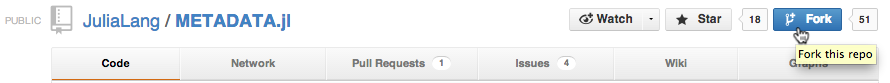
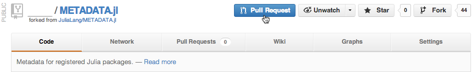
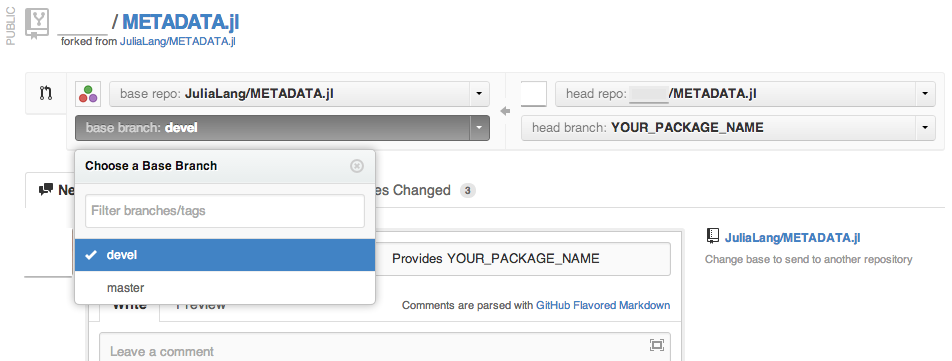

==============
Julia Packages
==============

Where to find Julia packages
----------------------------

- An official list of Julia packages is available at :ref:`available-packages`.

- Announcements of new packages can also be found on the `julia-users Google
  Groups <https://groups.google.com/forum/?fromgroups=#!forum/julia-users>`_.

.. _pkg-install:

How to use Julia packages
-------------------------

The ``Pkg`` module in Julia provides tools for installing and managing third
party packages. It also manages the dependencies while installing packages.

Get the updated list of packages with::

    Pkg.update()

In order to install a package, use ``Pkg.add()``, where ``MY_PACKAGE_NAME`` is
replaced with the actual package name::

   Pkg.add("MY_PACKAGE_NAME")

This installs the package to ``$HOME/.julia/MY_PACKAGE_NAME`` . In order to
remove a package, do::

   Pkg.rm("MY_PACKAGE_NAME")

The package system is still under active development. Sometimes, it
can get into an inconsistent state. Deleting the ``$HOME/.julia``
directory will wipe everything related to the package system. Repeat
all the steps listed here to start from a clean slate.

Contributing a new Julia package
--------------------------------

Internally, every Julia package is a ``git`` repository, and Julia uses ``git``
for its package management.

.. caution::
   The following instructions are provided in the hopes that most package
   developers will be able to use them with minimal fuss.
   Contributors who are new to ``git`` are **strongly** encouraged to work
   through at least `a tutorial <http://try.github.io/levels/1/challenges/1>`_ to
   become familiar with how to use ``git`` and to understand the various issues
   that may arise.
   
   As individual situations may vary, contributors should bear in mind that
   these instructions are meant as guidelines and not absolute commandments.
   Contributors, especially those new to ``git``, are encouraged to seek help
   from `the Julia community <http://julialang.org/community>`_ and to
   `file issues <https://github.com/JuliaLang/julia/issues>`_ with suggestions
   for improving these instructions or documenting situations in which they do
   not work.

In the following, replace ``MY_PACKAGE_NAME``, ``MY_GITHUB_USER``, etc. with the
actual desired names.

Creating a new Julia package
~~~~~~~~~~~~~~~~~~~~~~~~~~~~

1. Initialize your package in Julia by running::

    Pkg.new("MY_PACKAGE_NAME")

   This will initialize a skeleton for a new package in ``$HOME/.julia/MY_PACKAGE_NAME``.

.. note::
   This will overwrite any existing files and git repository in ``$HOME/.julia/MY_PACKAGE_NAME``.

2. If you have already created a repository for your package, overwrite the
skeleton by copying or symlinking over it. For example,::

    rm -r $HOME/.julia/MY_PACKAGE_NAME
    ln -s /path/to/existing/repo/MY_PACKAGE_NAME $HOME/.julia/MY_PACKAGE_NAME

3. In ``REQUIRE``, list the names of all packages used by your new package. One
package per line.

4. Populate the package by filling out ``README.md`` and ``LICENSE.md``, source
code in ``src/``, and tests in ``test/``. Ensure that each test file contains these
lines near the beginning::

    using Test
    using MY_PACKAGE_NAME

5. Add a publicly accessible remote repository URL, if your package doesn't
already have one. For example, create a new repository called
``MY_PACKAGE_NAME.jl`` on Github and then run::

    cd $HOME/.julia/MY_PACKAGE_NAME
    git remote add github https://github.com/MY_GITHUB_USER/MY_PACKAGE_NAME.jl
 
6. Add at least one git commit and push it to the remote repository::

    # Do some stuff
    git add #list of files goes here
    #Alternatively, to add all new and changed files, use
    #git add -A
    git commit
    git push -u github master

Distributing a Julia package
~~~~~~~~~~~~~~~~~~~~~~~~~~~~

Information about Julia packages is distributed through the
`METADATA.jl repository on GitHub <https://github.com/JuliaLang/METADATA.jl>`_,
which serves as a master list for available packages. Contributors are
encouraged to register their packages by updating this repository, so that their
packages will work with Julia's built-in package handling mechanism as described
in :ref:`pkg-install`.

Currently, updates are only accepted via the ``devel`` branch. Contributors
should ensure that their local METADATA has the ``devel`` branch checked out and
that the latest developments are on this branch.

One-time setup (once per user)
------------------------------
1. Fork a copy of METADATA.jl, if you haven't done so already.
   To do so, go to the `master METADATA.jl repository on GitHub <https://github.com/JuliaLang/METADATA.jl>`_
   in your web browser and click on the `Fork` button.

   
The forked repository URL should look like `https://github.com/MY_GITHUB_USER/METADATA.jl`.

2. Update the local METADATA with the URL of your forked repository.::

    cd $HOME/.julia/METADATA
    git remote add github https://github.com/MY_GITHUB_USER/METADATA.jl

3. If you have started development based off of the ``master`` branch, you will
need to migrate the changes to the ``devel`` branch. Try this instead of Step 1
of the next section.::

    cd $HOME/.julia/METADATA
    git stash                          #Save any local changes
    git branch -m old-master           #Move local master branch 
    git reset --hard origin/master     #Get a fresh copy of the master branch
    git checkout -b MY_PACKAGE_NAME devel #Start a new branch to work on from devel
    git rebase --onto MY_PACKAGE_NAME old-master #Migrate commits from old local master
    git stash pop                      #Apply any local changes

Distributing a new package or new version of an existing package
----------------------------------------------------------------

1. Ensure that both your forked METADATA.jl on Github and your local METADATA
   repository are current. If you haven't done so already, create a new branch
   with your latest updates.::

    cd $HOME/.julia/METADATA
    git stash                          #Save any local changes
    git fetch --all                 #Get the latest updates but don't apply them yet
    git checkout devel              #Change to devel branch
    git rebase origin/devel         #Updates local working repo
    git push github devel           #Update remote forked repo
    git checkout -b MY_PACKAGE_NAME devel #Put all existing and new development in its own branch
    git stash pop                      #Apply any local changes

2. Populate the local METADATA by running in Julia: ::

    Pkg.pkg_origin("MY_PACKAGE_NAME")
    Pkg.patch("MY_PACKAGE_NAME")

3. Update the local METADATA.::

    cd $HOME/.julia/METADATA
    git add MY_PACKAGE_NAME #Ensure that only the latest hash is committed
    git commit

4. Push to the remote METADATA repository::

    git push github MY_PACKAGE_NAME

5. Go to `https://github.com/MY_GITHUB_USER/METADATA.jl/tree/MY_PACKAGE_NAME`
in your web browser. Click the 'Pull Request' button.

6. Submit a new pull request. Ensure that the pull request goes to the
devel branch and not master.

7. When the pull request is accepted, announce your new package to the
Julia community on the `julia-users Google Groups <https://groups.google.com/forum/?fromgroups=#!forum/julia-users>`_.

8. The newly made branch ``MY_PACKAGE_NAME`` can now be safely deleted.::

    cd $HOME/.julia/METADATA
    git checkout devel      #Change back to devel branch
    git branch -d MY_PACKAGE_NAME
    git pull --rebase       #Update local METADATA

