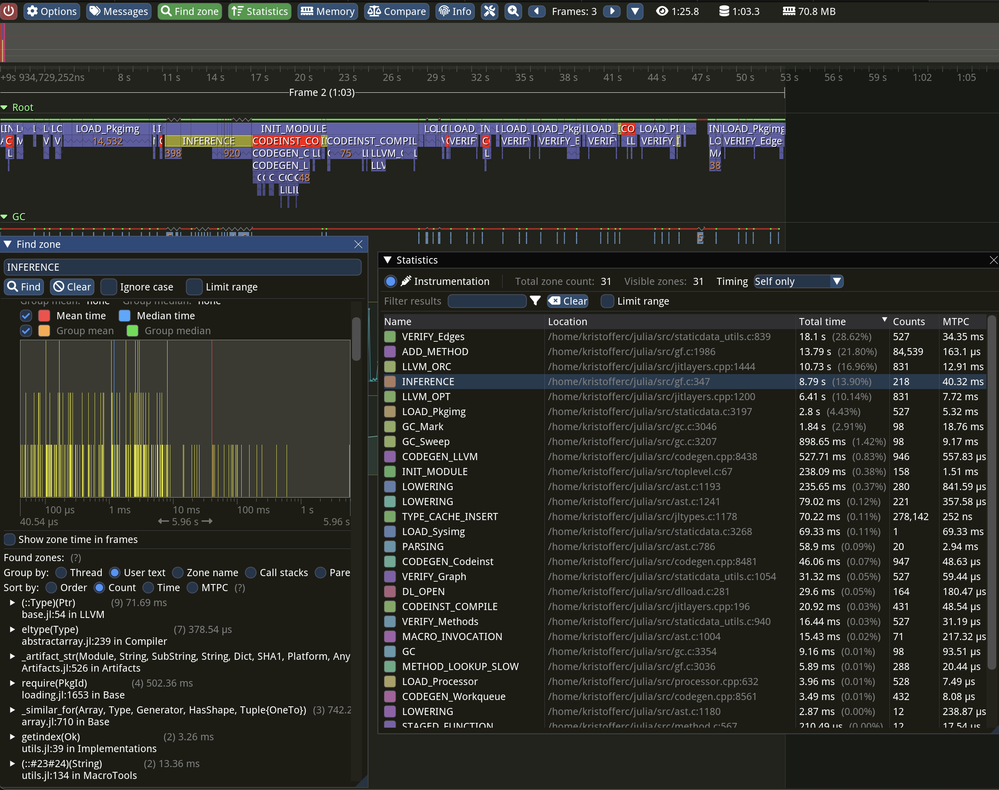

# External Profiler Support

Julia provides explicit support for some external tracing profilers, enabling you to obtain a high-level overview of the runtime's execution behavior.

The currently supported profilers are:
- [Tracy](https://github.com/wolfpld/tracy)
- [ITTAPI (VTune)](https://github.com/intel/ittapi)

### Adding New Zones

To add new zones, use the `JL_TIMING` macro. You can find numerous examples throughout the codebase by searching for `JL_TIMING`. To add a new type of zone
you add it to `JL_TIMING_OWNERS` (and possibly `JL_TIMING_EVENTS`).

### Dynamically Enabling and Disabling Zones

The `JULIA_TIMING_SUBSYSTEMS` environment variable allows you to enable or disable zones for a specific Julia run. For instance, setting the variable to `+GC,-INFERENCE` will enable the `GC` zones and disable the `INFERENCE`
zones.

## Tracy Profiler

[Tracy](https://github.com/wolfpld/tracy)  is a flexible profiler that can be optionally integrated with Julia.

A typical Tracy session might look like this:



### Building Julia with Tracy

To enable Tracy integration, build Julia with the extra option `WITH_TRACY=1` in the `Make.user` file.

### Installing the Tracy Profile Viewer

The easiest way to obtain the profile viewer is by adding the `TracyProfiler_jll` package and launching the profiler with:

```julia
run(TracyProfiler_jll.tracy())
```

!!! note
    On macOS, you may want to set the `TRACY_DPI_SCALE` environment variable to `1.0` if the UI elements in the profiler appear excessively large.

To run a "headless" instance that saves the trace to disk, use `TracyProfiler_jll.capture() -o mytracefile.tracy` instead.

For information on using the Tracy UI, refer to the Tracy manual.

### Profiling Julia with Tracy

A typical workflow for profiling Julia with Tracy involves starting Julia using:

```julia
JULIA_WAIT_FOR_TRACY=1 ./julia -e '...'
```

The environment variable ensures that Julia waits until it has successfully connected to the Tracy profiler before continuing execution. Afterward, use the Tracy profiler UI, click `Connect`, and Julia execution should resume and profiling should start.

### Adding metadata to zones

The various `jl_timing_show_*` and `jl_timing_printf` functions can be used to attach a string (or strings) to a zone. For example, the trace zone for inference shows the method instance that is being inferred.

The `TracyCZoneColor` function can be used to set the color of a certain zone. Search through the codebase to see how it is used.

### Hosting Tracy Traces Online

*This section is yet to be written.*

## ITTAPI Profiler

*This section is yet to be written.*
