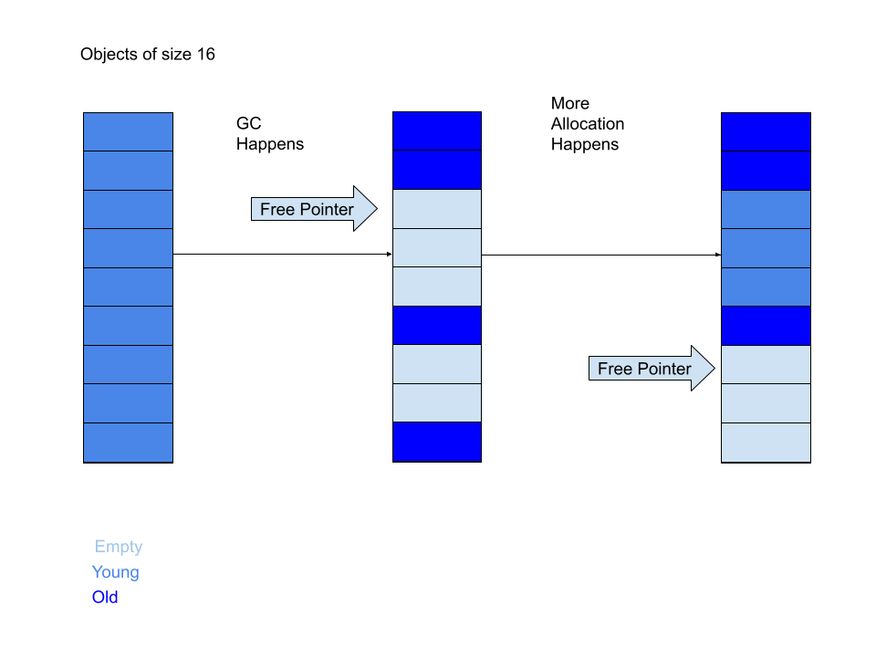
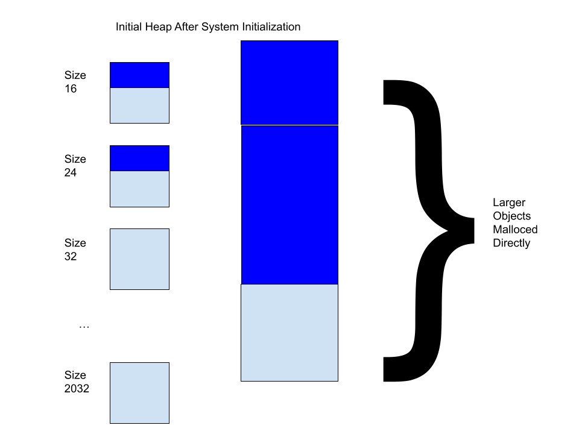
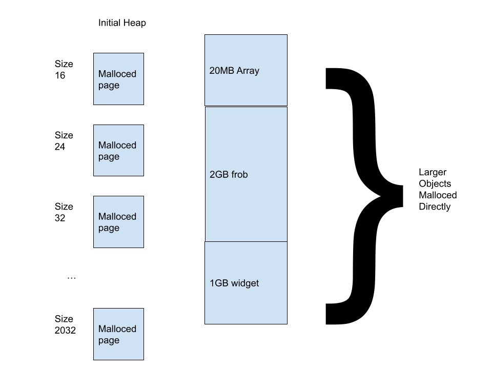
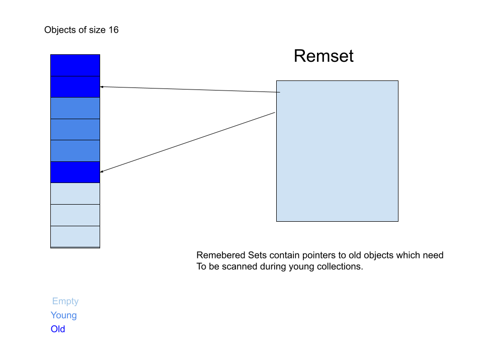

# Garbage Collection in Julia

## Allocation via Free Lists
Julia has a precise generational non-moving garbage collector.  Free lists, maintained by the GC, allow fast object allocation.

## Heuristics

GC heuristics tune the GC by changing the size of the allocation interval between garbage collections.  If a GC was unproductive than we increase the size of the allocation interval to allow objects more time to die.  If a GC returns a lot of space we can shrink the interval.  The goal is to find a steady state where we are allocating just about the same amount as we are collecting.

## System Initialization

When you start Julia you initialize the system by loading objects into memory. This is why your first GC might be a full GC because all

## Generational

## Remsets

