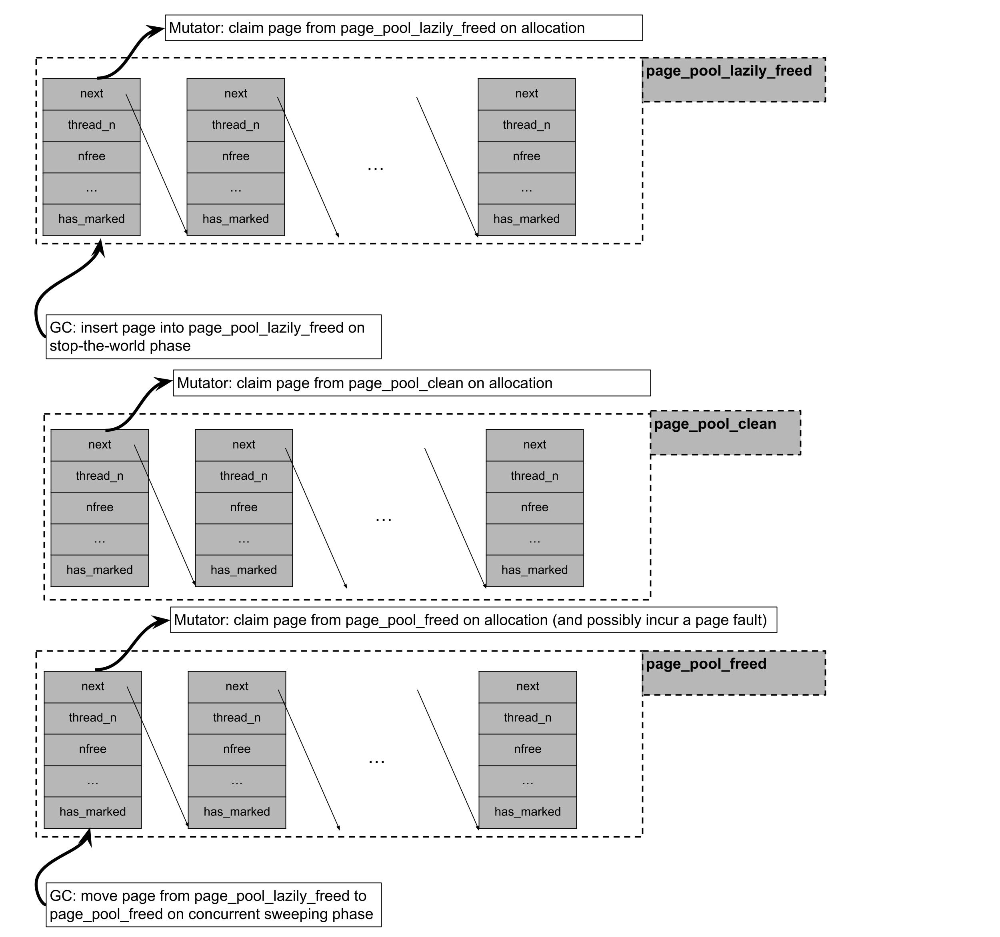

# Garbage Collection in Julia

## Introduction

Julia has a non-moving, partially concurrent, parallel, generational and mostly precise mark-sweep collector (an interface
for conservative stack scanning is provided as an option for users who wish to call Julia from C).

## Allocation

Julia uses two types of allocators, the size of the allocation request determining which one is used. Objects up to 2k
bytes are allocated on a per-thread free-list pool allocator, while objects larger than 2k bytes are allocated through libc
malloc.

Julia’s pool allocator partitions objects on different size classes, so that a memory page managed by the pool allocator
(which spans 4 operating system pages on 64bit platforms) only contains objects of the same size class. Each memory
page from the pool allocator is paired with some page metadata stored on per-thread lock-free lists. The page metadata contains information such as whether the page has live objects at all, number of free slots, and offsets to the first and last objects in the free-list contained in that page. These metadata are used to optimize the collection phase: a page which has no live objects at all may be returned to the operating system without any need of scanning it, for example.

While a page that has no objects may be returned to the operating system, its associated metadata is permanently
allocated and may outlive the given page. As mentioned above, metadata for allocated pages are stored on per-thread lock-free
lists. Metadata for free pages, however, may be stored into three separate lock-free lists depending on whether the page has been mapped but never accessed (`page_pool_clean`), or whether the page has been lazily sweeped and it's waiting to be madvised by a background GC thread (`page_pool_lazily_freed`), or whether the page has been madvised (`page_pool_freed`).

Julia's pool allocator follows a "tiered" allocation discipline. When requesting a memory page for the pool allocator, Julia will:

- Try to claim a page from `page_pool_lazily_freed`, which contains pages which were empty on the last stop-the-world phase, but not yet madivsed by a concurrent sweeper GC thread.

- If it failed claiming a page from `page_pool_lazily_freed`, it will try to claim a page from `the page_pool_clean`, which contains pages which were mmaped on a previous page allocation request but never accessed.

- If it failed claiming a page from `pool_page_clean` and from `page_pool_lazily_freed`, it will try to claim a page
  from `page_pool_freed`, which contains pages which have already been madvised by a concurrent sweeper GC thread and whose underlying virtual address can be recycled.

- If it failed in all of the attempts mentioned above, it will mmap a batch of pages, claim one page for itself, and
  insert the remaining pages into `page_pool_clean`.

## Marking and Generational Collection

Julia’s mark phase is implemented through a parallel iterative depth-first-search over the object graph. Julia’s collector is non-moving, so object age information can’t be determined through the memory region in which the object resides alone, but has to be somehow encoded in the object header or on a side table. The lowest two bits of an object’s header are used to store, respectively, a mark bit that is set when an object is scanned during the mark phase and an age bit for the generational collection.

Generational collection is implemented through sticky bits: objects are only pushed to the mark-stack, and therefore
traced, if their mark-bits are not set. When objects reach the oldest generation, their mark-bits are not reset during
the so-called "quick-sweep", which leads to these objects not being traced in a subsequent mark phase. A "full-sweep",
however, causes the mark-bits of all objects to be reset, leading to all objects being traced in a subsequent mark phase.
Objects are promoted to the next generation during every sweep phase they survive. On the mutator side, field writes
are intercepted through a write barrier that pushes an object’s address into a per-thread remembered set if the object is
in the last generation, and if the object at the field being written is not. Objects in this remembered set are then traced
during the mark phase.

## Sweeping

Sweeping of object pools for Julia may fall into two categories: if a given page managed by the pool allocator contains at least one live object, then a free-list must be threaded through its dead objects; if a given page contains no live objects at all, then its underlying physical memory may be returned to the operating system through, for instance, the use of madvise system calls on Linux.

The first category of sweeping is parallelized through work-stealing. For the second category of sweeping, if concurrent page sweeping is enabled through the flag `--gcthreads=X,1` we perform the madvise system calls in a background sweeper thread, concurrently with the mutator threads. During the stop-the-world phase of the collector, pool allocated pages which contain no live objects are initially pushed into the `pool_page_lazily_freed`. The background sweeping thread is then woken up and is responsible for removing pages from `pool_page_lazily_freed`, calling madvise on them, and inserting them into `pool_page_freed`. As described above, `pool_page_lazily_freed` is also shared with mutator threads. This implies that on allocation-heavy multithreaded workloads, mutator threads would often avoid a page fault on allocation (coming from accessing a fresh mmaped page or accessing a madvised page) by directly allocating from a page in `pool_page_lazily_freed`, while the background sweeper thread needs to madvise a reduce number of pages given some of them were already claimed by the mutators.

## Heuristics

GC heuristics tune the GC by changing the size of the allocation interval between garbage collections.

The GC heuristics measure how big the heap size is after a collection and set the next collection according to the algorithm described by https://dl.acm.org/doi/10.1145/3563323, in summary, it argues that the heap target should have a square root relationship with the live heap, and that it should also be scaled by how fast the GC is freeing objects and how fast the mutators are allocating. The heuristics measure the heap size by counting the number of pages that are in use and the objects that use malloc. Previously we measured the heap size by counting the alive objects, but that doesn't take into account fragmentation which could lead to bad decisions, that also meant that we used thread local information (allocations) to make decisions about a process wide (when to GC), measuring pages means the decision is global.

The GC will do full collections when the heap size reaches 80% of the maximum allowed size.
