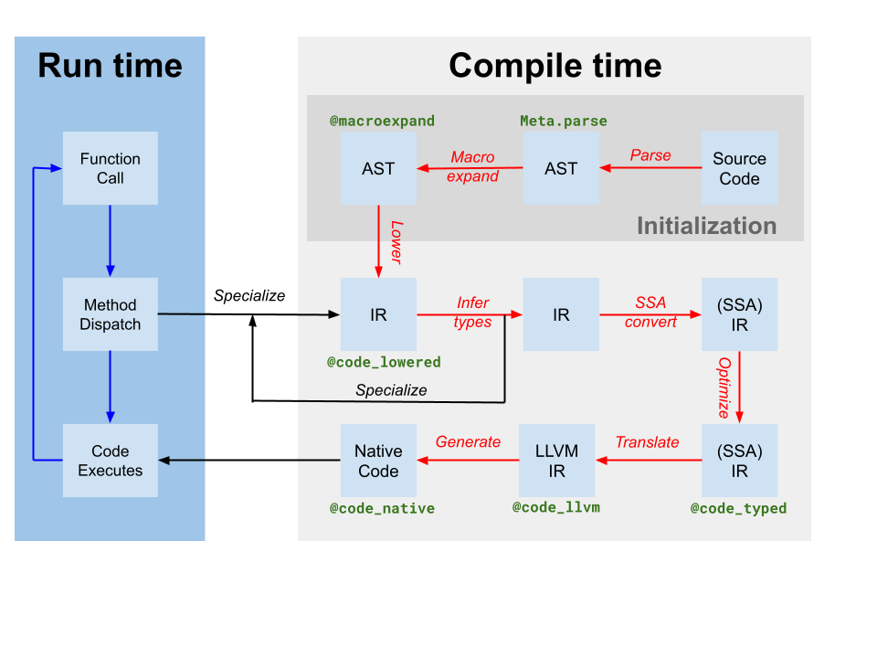

# JIT Design and Implementation

This document explains the design and implementation of Julia's JIT, after codegen has finished and unoptimized LLVM IR has been produced. The JIT is responsible for optimizing and compiling this IR to machine code, and for linking it into the current process and making the code available for execution.

## Introduction

The JIT is responsible for managing compilation resources, looking up previously compiled code, and compiling new code. It is primarily built on LLVM's [On-Request-Compilation](https://llvm.org/docs/ORCv2.html) (ORCv2) technology, which provides support for a number of useful features such as concurrent compilation, lazy compilation, and the ability to compile code in a separate process. Though LLVM provides a basic JIT compiler in the form of LLJIT, Julia uses many ORCv2 APIs directly to create its own custom JIT compiler.

## Overview

Codegen produces an LLVM module containing IR for one or more Julia functions from the original Julia SSA IR produced by type inference (labeled as translate on the compiler diagram above). It also produces a mapping of code-instance to LLVM function name. However, though some optimizations have been applied by the Julia-based compiler on Julia IR, the LLVM IR produced by codegen still contains many opportunities for optimization. Thus, the first step the JIT takes is to run a target-independent optimization pipeline[^tdp] on the LLVM module. Then, the JIT runs a target-dependent optimization pipeline, which includes target-specific optimizations and code generation, and outputs an object file. Finally, the JIT links the resulting object file into the current process and makes the code available for execution. All of this is controlled by code in `src/jitlayers.cpp`.

[^tdp]: This is not a totally-target independent pipeline, as transformations such as vectorization rely upon target information such as vector register width and cost modeling. Additionally, codegen itself makes a few target-dependent assumptions, and the optimization pipeline will take advantage of that knowledge.

Currently, only one thread at a time is permitted to enter the optimize-compile-link pipeline at a time, due to restrictions imposed by one of our linkers (RuntimeDyld). However, the JIT is designed to support concurrent optimization and compilation, and the linker restriction is expected to be lifted in the future when RuntimeDyld has been fully superseded on all platforms.

## Optimization Pipeline

The optimization pipeline is based off LLVM's new pass manager, but the pipeline is customized for Julia's needs. The pipeline is defined in `src/pipeline.cpp`, and broadly proceeds through a number of stages as detailed below.

1. Early Simplification
   1. These passes are mainly used to simplify the IR and canonicalize patterns so that later passes can identify those patterns more easily. Additionally, various intrinsic calls such as branch prediction hints and annotations are lowered into other metadata or other IR features. [`SimplifyCFG`](https://llvm.org/docs/Passes.html#simplifycfg-simplify-the-cfg) (simplify control flow graph), [`DCE`](https://llvm.org/docs/Passes.html#dce-dead-code-elimination) (dead code elimination), and [`SROA`](https://llvm.org/docs/Passes.html#sroa-scalar-replacement-of-aggregates) (scalar replacement of aggregates) are some of the key players here.
2. Early Optimization
   1. These passes are typically cheap and are primarily focused around reducing the number of instructions in the IR and propagating knowledge to other instructions. For example, [`EarlyCSE`](https://en.wikipedia.org/wiki/Common_subexpression_elimination) is used to perform common subexpression elimination, and [`InstCombine`](https://llvm.org/docs/Passes.html#instcombine-combine-redundant-instructions) and [`InstSimplify`](https://llvm.org/doxygen/classllvm_1_1InstSimplifyPass.html#details) perform a number of small peephole optimizations to make operations less expensive.
3. Loop Optimization
   1. These passes canonicalize and simplify loops. Loops are often hot code, which makes loop optimization extremely important for performance. Key players here include [`LoopRotate`](https://llvm.org/docs/Passes.html#loop-rotate-rotate-loops), [`LICM`](https://llvm.org/docs/Passes.html#licm-loop-invariant-code-motion), and [`LoopFullUnroll`](https://llvm.org/docs/Passes.html#loop-unroll-unroll-loops). Some bounds check elimination also happens here, as a result of the [`IRCE`](https://llvm.org/doxygen/InductiveRangeCheckElimination_8cpp_source.html) pass which can prove certain bounds are never exceeded.
4. Scalar Optimization
   1. The scalar optimization pipeline contains a number of more expensive, but more powerful passes such as [`GVN`](https://llvm.org/docs/Passes.html#gvn-global-value-numbering) (global value numbering), [`SCCP`](https://llvm.org/docs/Passes.html#sccp-sparse-conditional-constant-propagation) (sparse conditional constant propagation), and another round of bounds check elimination. These passes are expensive, but they can often remove large amounts of code and make vectorization much more successful and effective. Several other simplification and optimization passes intersperse the more expensive ones to reduce the amount of work they have to do.
5. Vectorization
   1. [Automatic vectorization](https://en.wikipedia.org/wiki/Automatic_vectorization) is an extremely powerful transformation for CPU-intensive code. Briefly, vectorization allows execution of a [single instruction on multiple data](https://en.wikipedia.org/wiki/Single_instruction,_multiple_data) (SIMD), e.g. performing 8 addition operations at the same time. However, proving code to be both capable of vectorization and profitable to vectorize is difficult, and this relies heavily on the prior optimization passes to massage the IR into a state where vectorization is worth it.
6. Intrinsic Lowering
   1. Julia inserts a number of custom intrinsics, for reasons such as object allocation, garbage collection, and exception handling. These intrinsics were originally placed to make optimization opportunities more obvious, but they are now lowered into LLVM IR to enable the IR to be emitted as machine code.
7. Cleanup
   1. These passes are last-chance optimizations, and perform small optimizations such as fused multiply-add propagation and division-remainder simplification. Additionally, targets that do not support half-precision floating point numbers will have their half-precision instructions lowered into single-precision instructions here, and passes are added to provide sanitizer support.

## Target-Dependent Optimization and Code Generation

LLVM provides target-dependent optimization and machine code generation in the same pipeline, located in the TargetMachine for a given platform. These passes include instruction selection, instruction scheduling, register allocation, and machine code emission. The LLVM documentation provides a good overview of the process, and the LLVM source code is the best place to look for details on the pipeline and passes.

## Linking

Currently, Julia is transitioning between two linkers: the older RuntimeDyld linker, and the newer [JITLink](https://llvm.org/docs/JITLink.html) linker. JITLink contains a number of features that RuntimeDyld does not have, such as concurrent and reentrant linking, but currently lacks good support for profiling integrations and does not yet support all of the platforms that RuntimeDyld supports. Over time, JITLink is expected to replace RuntimeDyld entirely. Further details on JITLink can be found in the LLVM documentation.

## Execution

Once the code has been linked into the current process, it is available for execution. This fact is made known to the generating codeinst by updating the `invoke`, `specsigflags`, and `specptr` fields appropriately. Codeinsts support upgrading `invoke`, `specsigflags`, and `specptr` fields, so long as every combination of these fields that exists at any given point in time is valid to be called. This allows the JIT to update these fields without invalidating existing codeinsts, supporting a potential future concurrent JIT. Specifically, the following states may be valid:
1. `invoke` is NULL, `specsigflags` is 0b00, `specptr` is NULL
   1. This is the initial state of a codeinst, and indicates that the codeinst has not yet been compiled.
2. `invoke` is non-null, `specsigflags` is 0b00, `specptr` is NULL
   1. This indicates that the codeinst was not compiled with any specialization, and that the codeinst should be invoked directly. Note that in this instance, `invoke` does not read either the `specsigflags` or `specptr` fields, and therefore they may be modified without invalidating the `invoke` pointer.
3. `invoke` is non-null, `specsigflags` is 0b10, `specptr` is non-null
   1. This indicates that the codeinst was compiled, but a specialized function signature was deemed unnecessary by codegen.
4. `invoke` is non-null, `specsigflags` is 0b11, `specptr` is non-null
   1. This indicates that the codeinst was compiled, and a specialized function signature was deemed necessary by codegen. The `specptr` field contains a pointer to the specialized function signature. The `invoke` pointer is permitted to read both `specsigflags` and `specptr` fields.

In addition, there are a number of different transitional states that occur during the update process. To account for these potential situations, the following write and read patterns should be used when dealing with these codeinst fields.

1. When writing `invoke`, `specsigflags`, and `specptr`:
      1. Perform an atomic compare-exchange operation of specptr assuming the old value was NULL. This compare-exchange operation should have at least acquire-release ordering, to provide ordering guarantees of the remaining memory operations in the write.
      2. If `specptr` was non-null, cease the write operation and wait for bit 0b10 of `specsigflags` to be written, then restart from step 1 if desired.
      3. Write the new low bit of `specsigflags` to its final value. This may be a relaxed write.
      4. Write the new `invoke` pointer to its final value. This must have at least a release memory ordering to synchronize with reads of `invoke`.
      5. Set the second bit of `specsigflags` to 1. This must be at least a release memory ordering to synchronize with reads of `specsigflags`. This step completes the write operation and announces to all other threads that all fields have been set.
2. When reading all of `invoke`, `specsigflags`, and `specptr`:
   1. Read the `specptr` field with any memory ordering.
   2. Read the `invoke` field with at least an acquire memory ordering. This load will be referred to as `initial_invoke`.
   3. If `initial_invoke` is NULL, the codeinst is not yet executable. `invoke` is NULL, `specsigflags` may be treated as 0b00, `specptr` may be treated as NULL.
   4. If `specptr` is NULL, then the `initial_invoke` pointer must not be relying on `specptr` to guarantee correct execution. Therefore, `invoke` is non-null, `specsigflags` may be treated as 0b00, `specptr` may be treated as NULL.
   5. If `specptr` is non-null, then `initial_invoke` might not be the final `invoke` field that uses `specptr`. This can occur if `specptr` has been written, but `invoke` has not yet been written. Therefore, spin on the second bit of `specsigflags` until it is set to 1 with at least acquire memory ordering.
   6. Re-read the `invoke` field with any memory ordering. This load will be referred to as `final_invoke`.
   7. Read the `specsigflags` field with any memory ordering.
   8. `invoke` is `final_invoke`, `specsigflags` is the value read in step 7, `specptr` is the value read in step 3.
3. When updating a `specptr` to a different but equivalent function pointer:
   1. Perform a release store of the new function pointer to `specptr`. Races here must be benign, as the old function pointer is required to still be valid, and any new ones are also required to be valid as well. Once a pointer has been written to `specptr`, it must always be callable whether or not it is later overwritten.

Correctly reading these fields is implemented in `jl_read_codeinst_invoke`.

Although these write, read, and update steps are complicated, they ensure that the JIT can update codeinsts without invalidating existing codeinsts, and that the JIT can update codeinsts without invalidating existing `invoke` pointers. This allows the JIT to potentially reoptimize functions at higher optimization levels in the future, and also will allow the JIT to support concurrent compilation of functions in the future.
