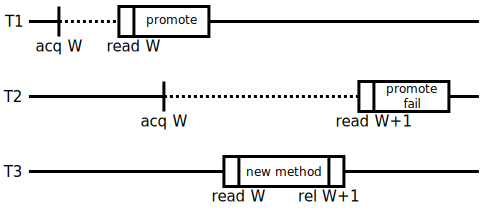

# [Proper maintenance and care of multi-threading locks](@id Proper-maintenance-and-care-of-multi-threading-locks)

The following strategies are used to ensure that the code is dead-lock free (generally by addressing
the 4th Coffman condition: circular wait).

1. structure code such that only one lock will need to be acquired at a time
2. always acquire shared locks in the same order, as given by the table below
3. avoid constructs that expect to need unrestricted recursion

## Types of locks

`uv_mutex_t` (or `std::mutex`) is a wrapper around platform-specific locks
(`pthread_mutex_t` on Unix, `CRITICAL_SECTION` on Windows).  It may cause the
current OS thread to block, is not reentrant, and is not a safepoint.

`jl_mutex_t` is a reentrant spinlock.  `jl_mutex_t`s acquired in a `try` block
will be unlocked when we leave the block, either by reaching the end or catching
an exception.  `JL_LOCK`/`JL_UNLOCK` are safepoints, while
`JL_LOCK_NOGC`/`JL_UNLOCK_NOGC` are not.  `jl_mutex_t` must not be held across
task switches.

## Lock hierarchy

Below are all of the locks that exist in the system and the mechanisms for using
them that avoid the potential for deadlocks (no Ostrich algorithm allowed here).
Except in the special cases where a rule for avoiding deadlock is given, no lock
of a lower level may acquire a lock at a higher level.

### Level 1

No other lock may be acquired when one of these locks is held.  As a result, the
code must not do any allocation or hit any safepoints. Note that there are
safepoints when doing allocation, enabling/disabling GC, entering/restoring
exception frames, and taking/releasing locks.

* `safepoint_lock` (`uv_mutex_t`)
  !!! danger

      This lock is acquired implicitly by `JL_LOCK` and `JL_UNLOCK`. Use the
      `_NOGC` variants to avoid that for level 1 locks.

* `shared_map_lock.mtx` (`uv_mutex_t`)
* `finalizers_lock` (`jl_mutex_t`)
* `gc_pages_lock` (`uv_mutex_t`)
* `gc_perm_lock` (`uv_mutex_t`)
* `gc_queue_observer_lock` (`uv_mutex_t`)
* `gc_threads_lock` (`uv_mutex_t`)
* `flisp_lock` (`uv_mutex_t`)
  !!! note
      flisp itself is already threadsafe; this lock only protects the
      `jl_ast_context_list_t` pool.  Likewise, the `ResourcePool<?>::mutexes`
      just protect the associated resource pool.

* `ResourcePool<?>.mutex` (`std::mutex`)
* `RLST_mutex` (`std::mutex`)
* `llvm_printing_mutex` (`std::mutex`)
* `jl_locked_stream.mutex` (`std::mutex`)
* `debuginfo_asyncsafe` (`uv_rwlock_t`) (can still acquire `jl_in_stackwalk` (`uv_mutex_t`, Win32 only))
* `profile_show_peek_cond_lock` (`jl_mutex_t`)
* `trampoline_lock` (`uv_mutex_t`)
* `bt_data_prof_lock` (`uv_mutex_t`)
* `jl_ptls_t.sleep_lock` (`uv_mutex_t`)
* `tls_lock` (`uv_mutex_t`)
* `page_profile_lock` (`uv_mutex_t`)
* `symtab_lock` (`uv_mutex_t`)
* `engine_lock` (`std::mutex`)

### Level 2

* `global_roots_lock`
* `jl_module_t.lock`
* `newly_inferred_mutex`
* `JLDebuginfoPlugin.PluginMutex` (`std::mutex`)
* `precompile_field_replace_lock`
* `live_tasks_lock` (`uv_mutex_t`)
* `heapsnapshot_lock`
* `jitlock`
* `jl_safepoint_suspend_all_threads` and `jl_safepoint_resume_all_threads`
  !!! note
      Inside a region protected by these functions, all other threads are
      blocked inside a safepoint.  It is unsafe to take locks that may safepoint
      in this region.

### Level 3

* `jl_method_t.writelock`
* `typecache_lock`
* `libmap_lock`

### Level 4

* `jl_methcache_t.writelock`

### Level 5

* `jl_methtable_t.writelock`

### Level 6

No Julia code may be called while holding a lock above this point.

* `world_counter_lock`
* `jl_typeinf_lock`

### Level 7

* `JuliaOJIT::EmissionMutex` (`std::recursive_mutex`)

* `jl_modules_mutex`

* `jl_uv_mutex` (known as `iolock` from Julia)
  !!! danger
      Doing any I/O (for example, printing warning messages or debug information)
      while holding any other lock listed above may result in pernicious and
      hard-to-find deadlocks.

* Individual `ThreadSynchronizer` locks
  !!! danger
      This may continue to be held after releasing the iolock, or acquired
      without it, but be very careful to never attempt to acquire the iolock
      while holding it.

* `Libdl.LazyLibrary.lock` (`ReentrantLock`)

* `orc::ThreadSafeContext`

* `cfun_lock`

### Level 8

* `precomp_statement_out_lock`
* `dispatch_statement_out_lock`

## Exceptions to the lock hierarchy

Ordinarily, it is forbidden to acquire locks of equal level to a lock already
held.  In these specific cases we use a special protocol for acquiring locks at
the same level:

- `jl_method_t.writelock`

  Invalidation acquires the lock for every method during its depth-first search
  for backedges.  To avoid deadlocks, we must already hold `world_counter_lock`
  before acquiring multiple `jl_method_t.writelock`s.

### Broken locks

The following locks are broken:

* `loading.jl`: `require` and `register_root_module`

   This file potentially has numerous problems. (fix: needs locks)

## Updates to the world counter

Thanks to the [world age](@ref man-world-age) mechanism, Julia can allow the
replacement of both methods and bindings, yet remain amenable to optimization.
Every compiled `CodeInstance` has a range of valid world ages; we could
conservatively assume all CIs are stale after a world age increment.  However,
to avoid spurious recompilation, we track dependencies, called "edges", while
maintaining the following invariant:

For every published `CodeInstance`, either:
- `min_world` and `max_world` are finite, and the CI is valid for every world
  in that range.
- `max_world` is ∞ (`-1`), and this CI is ready for invalidation, meaning
  for every forward edge:
  - If the edge is a `CodeInstance` that is invoked or inlined into this CI,
    the edge's `MethodInstance` `backedge` array has an entry pointing back.
  - If the edge is a `Binding`:
      - If the binding is in another module, it has an entry for this CI in its
        `backedges` array.
      - If the binding is in the same module, the `Method` for this CI is in the
        module's `scanned_methods` array.

For example, the following code replaces a constant in another module, causing a
chain of invalidations:
```julia
const c1 = 1
module M const c2 = 2 end
f() = getfield(M, :c2)
g() = f() + c1

g()                   # compile g

@eval M const c2 = 3  # invalidate f, g
g()                   # recompile g
```

After compiling the two versions of `g()`, the global cache looks like this:
```@raw html

```
```@raw latex
\begin{figure}
\centering
\includegraphics[max width=\linewidth]{devdocs/img/invalidation-example.pdf}
\caption{Global cache state after invalidation}
\end{figure}
```

The maximum world age, `jl_world_counter`, is protected by the
`world_counter_lock`.  Julia uses a form of optimistic concurrency control to
allow type inference without holding `world_counter_lock`.

Publishing a new method or binding follows these steps:
- Acquire `world_counter_lock`.
- Relaxed-load `jl_world_counter` and let `new_world = jl_world_counter + 1`.
- Publish the new binding partitions or method table entries with world range
  `[new_world, ∞)`.  This step is described in the section on the [lock free
  data structures](@ref man-lock-free-data).
- Release-store `new_world` to `jl_world_counter`.
- Release `world_counter_lock`.

Type inference proceeds like so:
- Acquire-load `jl_world_counter` (call this `validation_world`).
- Perform type inference in that world, reading the bindings and method table in
  that world using the lock-free data structures.
- Store back edges for every inferred `CodeInstance`:
  - For non-local bindings, this acquires the binding's module's lock.
  - For CIs, this acquires the method's lock.
- Acquire `world_counter_lock`.
- Relaxed-load `jl_world_counter` and compare it to `validation_world`:
  - If it is different, leave the valid world ranges for the inferred CIs
    unchanged.
  - If it is unchanged, our optimism was rewarded.  We can promote all the
    inferred CIs valid in `validation_world` to `[validation_world, ∞)` and rely
    on the backedges for invalidation.
- Release `world_counter_lock`.

```@raw html

```
```@raw latex
\begin{figure}
\centering
\includegraphics[max width=\linewidth]{devdocs/img/typeinf-promotion.pdf}
\caption{Two threads doing type inference while another adds a method}
\end{figure}
```

In the above diagram, threads 1 and 2 are doing type inference (the dotted
line), while thread 3 is activating a new method.  The solid boxes represent
critical sections where the `world_counter_lock` is held.  `acq`, `rel`, and
`read`, are acquire loads, release stores, and relaxed loads respectively.

T1 promotes its CI in time, but T2 takes too long, blocking on
`world_counter_lock` until T3 has finished publishing the new method and
incrementing the world counter.  It reads `W+1` and fails to promote its CI,
leaving it with a maximum world of `W`.

## [Lock free data structures](@id man-lock-free-data)
TODO
