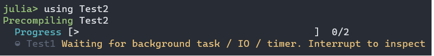

# Fixing precompilation hangs due to open tasks or IO

On Julia 1.10 or higher, you might see the following message:



If you follow the advice and hit `Ctrl-C`, you might see

```
^C Interrupted: Exiting precompilation...

  1 dependency had warnings during precompilation:
┌ Test1 [ac89d554-e2ba-40bc-bc5c-de68b658c982]
│  [pid 2745] waiting for IO to finish:
│   Handle type        uv_handle_t->data
│   timer              0x55580decd1e0->0x7f94c3a4c340
```

and, depending on how long you waited, this may repeat.

This message conveys two key pieces of information:

- the hang is occurring during precompilation of `Test1`, a dependency of `Test2` (the package we were trying to load with `using Test2`)
- during precompilation of `Test1`, Julia created a `Timer` object (use `?Timer` if you're unfamiliar with Timers) which is still open; until that closes, the process is hung

If this is enough of a hint for you to figure out how `timer = Timer(args...)` is being created, one good solution is to add `wait(timer)` if `timer` eventually finishes on its own, or `close(timer)` if you need to force-close it, before the final `end` of the module.

However, there are cases that may not be that straightforward. Usually the best option is to start by determining whether the hang is due to code in Test1 or whether it is due to one of Test1's dependencies:

1. `Pkg.develop("Test1")`
2. Comment out all the code `include`d or defined in `Test1`, *except* the `using/import` statements
3. Try `using Test2` (or even `using Test1` assuming that hangs too) again

Now we arrive at a fork in the road: either

- the hang persists, indicating it is due to one of your dependencies
- the hang disappears, indicating that it is due to something in your code

## If the hang is due to a package dependency

Use a binary search to identify the problematic dependency: start by commenting out half your dependencies, then when you isolate which half is responsible comment out half of that half, etc. (You don't have to remove them from the project, just comment out the `using`/`import` statements.)

Once you've identified a suspect (here we'll call it `ThePackageYouThinkIsCausingTheProblem`), first try precompiling that package. If it also hangs during precompilation, continue chasing the problem backwards.

However, most likely `ThePackageYouThinkIsCausingTheProblem` will precompile fine. This suggests it's in the function `ThePackageYouThinkIsCausingTheProblem.__init__`, which does not run during precompilation of `ThePackageYouThinkIsCausingTheProblem` but *does* in any package that loads `ThePackageYouThinkIsCausingTheProblem`.  To test this theory, set up a minimal working example (MWE), something like

```julia
(@v1.10) pkg> generate MWE
  Generating  project MWE:
    MWE\Project.toml
    MWE\src\MWE.jl
```

where the source code of `MWE.jl` is

```julia
module MWE
using ThePackageYouThinkIsCausingTheProblem
end
```

and you've added `ThePackageYouThinkIsCausingTheProblem` to MWE's dependencies.

If that MWE reproduces the hang, you've found your culprit:
`ThePackageYouThinkIsCausingTheProblem.__init__` must be creating the `Timer` object. If the timer object can be safely `close`d, that's a good option. Otherwise, the most common solution is to avoid creating the timer while *any* package is being precompiled: add

```julia
ccall(:jl_generating_output, Cint, ()) == 1 && return nothing
```

as the first line of `ThePackageYouThinkIsCausingTheProblem.__init__`, and it will avoid doing any initialization in any Julia process whose purpose is to precompile packages.

## If the hang is in your code

Search your package for suggestive words (here like "Timer") and see if you can identify where the problem is being created. Note that a method *definition* like

```julia
maketimer() = Timer(timer -> println("hi"), 0; interval=1)
```

is not problematic in and of itself: it can cause this problem only if `maketimer` gets called while the module is being defined. This might be happening from a top-level statement such as

```julia
const GLOBAL_TIMER = maketimer()
```

or it might conceivably occur in a [precompile workload](https://github.com/JuliaLang/PrecompileTools.jl).

If you struggle to identify the causative lines, then consider doing a binary search: comment out sections of your package (or `include` lines to omit entire files) until you've reduced the problem in scope.
