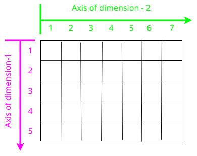
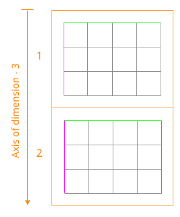
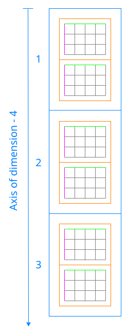

# [Single- and multi-dimensional Arrays](@id man-multi-dim-arrays)

Julia, like most technical computing languages, provides a first-class array implementation. Most
technical computing languages pay a lot of attention to their array implementation at the expense
of other containers. Julia does not treat arrays in any special way. The array library is implemented
almost completely in Julia itself, and derives its performance from the compiler, just like any
other code written in Julia. As such, it's also possible to define custom array types by inheriting
from [`AbstractArray`](@ref). See the [manual section on the AbstractArray interface](@ref man-interface-array)
for more details on implementing a custom array type.

An array is a collection of objects stored in a multi-dimensional grid. Zero-dimensional arrays
are allowed, see [this FAQ entry](@ref faq-array-0dim). In the most general case,
an array may contain objects of type [`Any`](@ref). For most computational purposes, arrays should contain
objects of a more specific type, such as [`Float64`](@ref) or [`Int32`](@ref).

In general, unlike many other technical computing languages, Julia does not expect programs to
be written in a vectorized style for performance. Julia's compiler uses type inference and generates
optimized code for scalar array indexing, allowing programs to be written in a style that is convenient
and readable, without sacrificing performance, and using less memory at times.

In Julia, all arguments to functions are [passed by
sharing](https://en.wikipedia.org/wiki/Evaluation_strategy#Call_by_sharing)
(i.e. by pointers). Some technical computing languages pass arrays by value, and
while this prevents accidental modification by callees of a value in the caller,
it makes avoiding unwanted copying of arrays difficult. By convention, a
function name ending with a `!` indicates that it will mutate or destroy the
value of one or more of its arguments (compare, for example, [`sort`](@ref) and [`sort!`](@ref)).
Callees must make explicit copies to ensure that they don't modify inputs that
they don't intend to change. Many non-mutating functions are implemented by
calling a function of the same name with an added `!` at the end on an explicit
copy of the input, and returning that copy.

## Basic Functions

| Function               | Description                                                                      |
|:---------------------- |:-------------------------------------------------------------------------------- |
| [`eltype(A)`](@ref)    | the type of the elements contained in `A`                                        |
| [`length(A)`](@ref)    | the number of elements in `A`                                                    |
| [`ndims(A)`](@ref)     | the number of dimensions of `A`                                                  |
| [`size(A)`](@ref)      | a tuple containing the dimensions of `A`                                         |
| [`size(A,n)`](@ref)    | the size of `A` along dimension `n`                                              |
| [`axes(A)`](@ref)      | a tuple containing the valid indices of `A`                                      |
| [`axes(A,n)`](@ref)    | a range expressing the valid indices along dimension `n`                         |
| [`eachindex(A)`](@ref) | an efficient iterator for visiting each position in `A`                          |
| [`stride(A,k)`](@ref)  | the stride (linear index distance between adjacent elements) along dimension `k` |
| [`strides(A)`](@ref)   | a tuple of the strides in each dimension                                         |

## Construction and Initialization

Many functions for constructing and initializing arrays are provided. In the following list of
such functions, calls with a `dims...` argument can either take a single tuple of dimension sizes
or a series of dimension sizes passed as a variable number of arguments. Most of these functions
also accept a first input `T`, which is the element type of the array. If the type `T` is
omitted it will default to [`Float64`](@ref).

| Function                           | Description                                                                                                                                                                                                                                  |
|:---------------------------------- |:-------------------------------------------------------------------------------------------------------------------------------------------------------------------------------------------------------------------------------------------- |
| [`Array{T}(undef, dims...)`](@ref)             | an uninitialized dense [`Array`](@ref)                                                                                                                                                                                                              |
| [`zeros(T, dims...)`](@ref)                    | an `Array` of all zeros                                                                                                                                                                                                                      |
| [`ones(T, dims...)`](@ref)                     | an `Array` of all ones                                                                                                                                                                                                                       |
| [`trues(dims...)`](@ref)                       | a [`BitArray`](@ref) with all values `true`                                                                                                                                                                                                  |
| [`falses(dims...)`](@ref)                      | a `BitArray` with all values `false`                                                                                                                                                                                                         |
| [`reshape(A, dims...)`](@ref)                  | an array containing the same data as `A`, but with different dimensions                                                                                                                                                                      |
| [`copy(A)`](@ref)                              | copy `A`                                                                                                                                                                                                                                     |
| [`deepcopy(A)`](@ref)                          | copy `A`, recursively copying its elements                                                                                                                                                                                                   |
| [`similar(A, T, dims...)`](@ref)               | an uninitialized array of the same type as `A` (dense, sparse, etc.), but with the specified element type and dimensions. The second and third arguments are both optional, defaulting to the element type and dimensions of `A` if omitted. |
| [`reinterpret(T, A)`](@ref)                    | an array with the same binary data as `A`, but with element type `T`                                                                                                                                                                         |
| [`rand(T, dims...)`](@ref)                     | an `Array` with random, iid [^1] and uniformly distributed values. For floating point types `T`, the values lie in the half-open interval ``[0, 1)``.                                                                                                                                       |
| [`randn(T, dims...)`](@ref)                    | an `Array` with random, iid and standard normally distributed values                                                                                                                                                                         |
| [`Matrix{T}(I, m, n)`](@ref)                   | `m`-by-`n` identity matrix. Requires `using LinearAlgebra` for [`I`](@ref).                                                                                                                                                                                                                   |
| [`range(start, stop, n)`](@ref)                | a range of `n` linearly spaced elements from `start` to `stop` |
| [`fill!(A, x)`](@ref)                          | fill the array `A` with the value `x`                                                                                                                                                                                                        |
| [`fill(x, dims...)`](@ref)                     | an `Array` filled with the value `x`. In particular, `fill(x)` constructs a zero-dimensional `Array` containing `x`. |

[^1]: *iid*, independently and identically distributed.

To see the various ways we can pass dimensions to these functions, consider the following examples:
```jldoctest
julia> zeros(Int8, 2, 3)
2×3 Matrix{Int8}:
 0  0  0
 0  0  0

julia> zeros(Int8, (2, 3))
2×3 Matrix{Int8}:
 0  0  0
 0  0  0

julia> zeros((2, 3))
2×3 Matrix{Float64}:
 0.0  0.0  0.0
 0.0  0.0  0.0
```
Here, `(2, 3)` is a [`Tuple`](@ref) and the first argument — the element type — is optional, defaulting to `Float64`.

## [Array literals](@id man-array-literals)

Arrays can also be directly constructed with square braces; the syntax `[A, B, C, ...]`
creates a one-dimensional array (i.e., a vector) containing the comma-separated arguments as
its elements. The element type ([`eltype`](@ref)) of the resulting array is automatically
determined by the types of the arguments inside the braces. If all the arguments are the
same type, then that is its `eltype`. If they all have a common
[promotion type](@ref conversion-and-promotion) then they get converted to that type using
[`convert`](@ref) and that type is the array's `eltype`. Otherwise, a heterogeneous array
that can hold anything — a `Vector{Any}` — is constructed; this includes the literal `[]`
where no arguments are given. [Array literals can be typed](@ref man-array-typed-literal) with
the syntax `T[A, B, C, ...]` where `T` is a type.

```jldoctest
julia> [1, 2, 3] # An array of `Int`s
3-element Vector{Int64}:
 1
 2
 3

julia> promote(1, 2.3, 4//5) # This combination of Int, Float64 and Rational promotes to Float64
(1.0, 2.3, 0.8)

julia> [1, 2.3, 4//5] # Thus that's the element type of this Array
3-element Vector{Float64}:
 1.0
 2.3
 0.8

julia> Float32[1, 2.3, 4//5] # Specify element type manually
3-element Vector{Float32}:
 1.0
 2.3
 0.8

julia> []
Any[]
```

### [Concatenation](@id man-array-concatenation)

If the arguments inside the square brackets are separated by single semicolons (`;`) or newlines
instead of commas, then their contents are _vertically concatenated_ together instead of
the arguments being used as elements themselves.

```jldoctest
julia> [1:2, 4:5] # Has a comma, so no concatenation occurs. The ranges are themselves the elements
2-element Vector{UnitRange{Int64}}:
 1:2
 4:5

julia> [1:2; 4:5]
4-element Vector{Int64}:
 1
 2
 4
 5

julia> [1:2
        4:5
        6]
5-element Vector{Int64}:
 1
 2
 4
 5
 6
```

Similarly, if the arguments are separated by tabs or spaces or double semicolons, then their contents are
_horizontally concatenated_ together.

```jldoctest
julia> [1:2  4:5  7:8]
2×3 Matrix{Int64}:
 1  4  7
 2  5  8

julia> [[1,2]  [4,5]  [7,8]]
2×3 Matrix{Int64}:
 1  4  7
 2  5  8

julia> [1 2 3] # Numbers can also be horizontally concatenated
1×3 Matrix{Int64}:
 1  2  3

julia> [1;; 2;; 3;; 4]
1×4 Matrix{Int64}:
 1  2  3  4
```

Single semicolons (or newlines) and spaces (or tabs) can be combined to concatenate
both horizontally and vertically at the same time.

```jldoctest
julia> [1 2
        3 4]
2×2 Matrix{Int64}:
 1  2
 3  4

julia> [zeros(Int, 2, 2) [1; 2]
        [3 4]            5]
3×3 Matrix{Int64}:
 0  0  1
 0  0  2
 3  4  5

julia> [[1 1]; 2 3; [4 4]]
3×2 Matrix{Int64}:
 1  1
 2  3
 4  4
```

Spaces (and tabs) have a higher precedence than semicolons, performing any horizontal
concatenations first and then concatenating the result. Using double semicolons for the
horizontal concatenation, on the other hand, performs any vertical concatenations before
horizontally concatenating the result.

```jldoctest
julia> [zeros(Int, 2, 2) ; [3 4] ;; [1; 2] ; 5]
3×3 Matrix{Int64}:
 0  0  1
 0  0  2
 3  4  5

julia> [1:2; 4;; 1; 3:4]
3×2 Matrix{Int64}:
 1  1
 2  3
 4  4
```

Just as `;` and `;;` concatenate in the first and second dimension, using more semicolons
extends this same general scheme. The number of semicolons in the separator specifies the
particular dimension, so `;;;` concatenates in the third dimension, `;;;;` in the 4th, and
so on. Fewer semicolons take precedence, so the lower dimensions are generally concatenated
first.

```jldoctest
julia> [1; 2;; 3; 4;; 5; 6;;;
        7; 8;; 9; 10;; 11; 12]
2×3×2 Array{Int64, 3}:
[:, :, 1] =
 1  3  5
 2  4  6

[:, :, 2] =
 7   9  11
 8  10  12
```

Like before, spaces (and tabs) for horizontal concatenation have a higher precedence than
any number of semicolons. Thus, higher-dimensional arrays can also be written by specifying
their rows first, with their elements textually arranged in a manner similar to their layout:

```jldoctest
julia> [1 3 5
        2 4 6;;;
        7 9 11
        8 10 12]
2×3×2 Array{Int64, 3}:
[:, :, 1] =
 1  3  5
 2  4  6

[:, :, 2] =
 7   9  11
 8  10  12

julia> [1 2;;; 3 4;;;; 5 6;;; 7 8]
1×2×2×2 Array{Int64, 4}:
[:, :, 1, 1] =
 1  2

[:, :, 2, 1] =
 3  4

[:, :, 1, 2] =
 5  6

[:, :, 2, 2] =
 7  8

julia> [[1 2;;; 3 4];;;; [5 6];;; [7 8]]
1×2×2×2 Array{Int64, 4}:
[:, :, 1, 1] =
 1  2

[:, :, 2, 1] =
 3  4

[:, :, 1, 2] =
 5  6

[:, :, 2, 2] =
 7  8
```

Although they both mean concatenation in the second dimension, spaces (or tabs) and `;;`
cannot appear in the same array expression unless the double semicolon is simply serving as
a "line continuation" character. This allows a single horizontal concatenation to span
multiple lines (without the line break being interpreted as a vertical concatenation).

```jldoctest
julia> [1 2 ;;
       3 4]
1×4 Matrix{Int64}:
 1  2  3  4
```

Terminating semicolons may also be used to add trailing length 1 dimensions.

```jldoctest
julia> [1;;]
1×1 Matrix{Int64}:
 1

julia> [2; 3;;;]
2×1×1 Array{Int64, 3}:
[:, :, 1] =
 2
 3
```

More generally, concatenation can be accomplished through the [`cat`](@ref) function.
These syntaxes are shorthands for function calls that themselves are convenience functions:

| Syntax                 | Function         | Description                                                                                                |
|:---------------------- |:---------------- |:---------------------------------------------------------------------------------------------------------- |
|                        | [`cat`](@ref)    | concatenate input arrays along dimension(s) `k`                                                            |
| `[A; B; C; ...]`       | [`vcat`](@ref)   | shorthand for `cat(A...; dims=1)`                                                                          |
| `[A B C ...]`          | [`hcat`](@ref)   | shorthand for `cat(A...; dims=2)`                                                                          |
| `[A B; C D; ...]`      | [`hvcat`](@ref)  | simultaneous vertical and horizontal concatenation                                                         |
| `[A; C;; B; D;;; ...]` | [`hvncat`](@ref) | simultaneous n-dimensional concatenation, where number of semicolons indicate the dimension to concatenate |

### [Typed array literals](@id man-array-typed-literal)

An array with a specific element type can be constructed using the syntax `T[A, B, C, ...]`. This
will construct a 1-d array with element type `T`, initialized to contain elements `A`, `B`, `C`,
etc. For example, `Any[x, y, z]` constructs a heterogeneous array that can contain any values.

Concatenation syntax can similarly be prefixed with a type to specify the element type of the
result.

```jldoctest
julia> [[1 2] [3 4]]
1×4 Matrix{Int64}:
 1  2  3  4

julia> Int8[[1 2] [3 4]]
1×4 Matrix{Int8}:
 1  2  3  4
```

## [Comprehensions](@id man-comprehensions)

Comprehensions provide a general and powerful way to construct arrays. Comprehension syntax is
similar to set construction notation in mathematics:

```julia
A = [ F(x, y, ...) for x=rx, y=ry, ... ]
```

The meaning of this form is that `F(x,y,...)` is evaluated with the variables `x`, `y`, etc. taking
on each value in their given list of values. Values can be specified as any iterable object, but
will commonly be ranges like `1:n` or `2:(n-1)`, or explicit arrays of values like `[1.2, 3.4, 5.7]`.
The result is an N-d dense array with dimensions that are the concatenation of the dimensions
of the variable ranges `rx`, `ry`, etc. and each `F(x,y,...)` evaluation returns a scalar.

The following example computes a weighted average of the current element and its left and right
neighbor along a 1-d grid:

```jldoctest
julia> x = [4, 8, 2, 6, 10, 10, 2, 8]
8-element Vector{Int64}:
  4
  8
  2
  6
 10
 10
  2
  8

julia> [ 0.25*x[i-1] + 0.5*x[i] + 0.25*x[i+1] for i=2:length(x)-1 ]
6-element Vector{Float64}:
 5.5
 4.5
 6.0
 9.0
 8.0
 5.5
```

The resulting array type depends on the types of the computed elements just like [array literals](@ref man-array-literals) do. In order to control the
type explicitly, a type can be prepended to the comprehension. For example, we could have requested
the result in single precision by writing:

```julia
Float32[ 0.25*x[i-1] + 0.5*x[i] + 0.25*x[i+1] for i=2:length(x)-1 ]
```

## [Generator Expressions](@id man-generators)

Comprehensions can also be written without the enclosing square brackets, producing an object
known as a generator. This object can be iterated to produce values on demand, instead of allocating
an array and storing them in advance (see [Iteration](@ref)). For example, the following expression
sums a series without allocating memory:

```jldoctest
julia> sum(1/n^2 for n=1:1000)
1.6439345666815615
```

When writing a generator expression with multiple dimensions inside an argument list, parentheses
are needed to separate the generator from subsequent arguments:

```jldoctest
julia> map(tuple, 1/(i+j) for i=1:2, j=1:2, [1:4;])
ERROR: ParseError:
# Error @ none:1:44
map(tuple, 1/(i+j) for i=1:2, j=1:2, [1:4;])
#                                          └ ── invalid iteration spec: expected one of `=` `in` or `∈`
```

All comma-separated expressions after `for` are interpreted as ranges. Adding parentheses lets
us add a third argument to [`map`](@ref):

```jldoctest
julia> map(tuple, (1/(i+j) for i=1:2, j=1:2), [1 3; 2 4])
2×2 Matrix{Tuple{Float64, Int64}}:
 (0.5, 1)       (0.333333, 3)
 (0.333333, 2)  (0.25, 4)
```

Generators are implemented via inner functions. Just like
inner functions used elsewhere in the language, variables from the enclosing scope can be
"captured" in the inner function. For example, `sum(p[i] - q[i] for i=1:n)`
captures the three variables `p`, `q` and `n` from the enclosing scope.
Captured variables can present performance challenges; see
[performance tips](@ref man-performance-captured).


Ranges in generators and comprehensions can depend on previous ranges by writing multiple `for`
keywords:

```jldoctest
julia> [(i, j) for i=1:3 for j=1:i]
6-element Vector{Tuple{Int64, Int64}}:
 (1, 1)
 (2, 1)
 (2, 2)
 (3, 1)
 (3, 2)
 (3, 3)
```

In such cases, the result is always 1-d.

Generated values can be filtered using the `if` keyword:

```jldoctest
julia> [(i, j) for i=1:3 for j=1:i if i+j == 4]
2-element Vector{Tuple{Int64, Int64}}:
 (2, 2)
 (3, 1)
```

## [Indexing](@id man-array-indexing)

### Scalar Indices

For a 2-dimensional array, we first choose the row, and then the column to get to the element we want to select.

```jldoctest
julia> A = reshape(1:35, 5, 7)
5×7 reshape(::UnitRange{Int64}, 5, 7) with eltype Int64:
 1   6  11  16  21  26  31
 2   7  12  17  22  27  32
 3   8  13  18  23  28  33
 4   9  14  19  24  29  34
 5  10  15  20  25  30  35

julia> A[2, 4]
17
```

In the above example, we have a $5 \times 7$ array, and we want to select the element in the $2^{nd}$ row and $4^{th}$ column, which is $17$. The row is considered the first dimension with its axis going from 1 to 5, and the column is considered the second dimension with its axis going from 1 to 7.

```jldoctest
julia> A = reshape(1:35, 5, 7);

julia> axes(A, 1)  # indices for the 1st dimension
Base.OneTo(5)

julia> axes(A, 2)  # indices for the 2nd dimension
Base.OneTo(7)
```



We can also use the special keywords `begin` and `end` to specify the first and the last index along a specific dimension.

```jldoctest
julia> A = reshape(1:35, 5, 7);

julia> A[begin+1, end-2]
22
```

We got the $1 + 1 = 2^{nd}$ row, and within that, the $7 - 1 = 6^{th}$ column. At first glance, `begin` might seem  a bit redundant, but if somebody has a crazy implementation of `AbstractArray` where the indexing begins with $0$, or $42$, or something else, `begin` starts to make a lot more sense.

Indexing into a multidimensional array is similar, we choose the block from each dimension that will lead us to the element we want to select. To understand this better, lets first create a $3 \times 4 \times 2 \times 3$ four-dimensional array.

```jldoctest
julia> B = reshape(1:3*4*2*3, 3, 4, 2, 3)
3×4×2×3 reshape(::UnitRange{Int64}, 3, 4, 2, 3) with eltype Int64:
[:, :, 1, 1] =
 1  4  7  10
 2  5  8  11
 3  6  9  12

[:, :, 2, 1] =
 13  16  19  22
 14  17  20  23
 15  18  21  24

[:, :, 1, 2] =
 25  28  31  34
 26  29  32  35
 27  30  33  36

[:, :, 2, 2] =
 37  40  43  46
 38  41  44  47
 39  42  45  48

[:, :, 1, 3] =
 49  52  55  58
 50  53  56  59
 51  54  57  60

[:, :, 2, 3] =
 61  64  67  70
 62  65  68  71
 63  66  69  72
```

One way to visualize this array is to think of it as having a bunch of two-dimensional ($3 \times 4$) arrays. I have $2$ such arrays in a block, and I have $3$ such blocks, to give me a total of $6$ two-dimensional arrays.





```jldoctest
julia> B = reshape(1:3*4*2*3, 3, 4, 2, 3);

julia> B[2, 4, 2, 3]
71
```

When indexing, set the indices from the right until you reach the $3 \times 4$ array you want to choose. In the example above, reading from the right, I first want to choose the $3^{rd}$ outer block. Put another way, I want to choose the $3^{rd}$ element along the fourth dimension. Within that, I want to choose the $2^{nd}$ inner block. Again, put another way, I want to choose the $2^{nd}$ element along the third dimension. This gives me the $3 \times 4$ array I want. Once I have that, I choose the row and column as before -- choose the $2^{nd}$ row and $4^{th}$ column. You can continue to read this from the right, i.e., select the $4^{th}$ element along the second dimension, and then finally select the $2^{nd}$ element along the first dimension.

We need to provide an index for each dimension, for `A`, we need to provide 2 numbers in the index, for `B` we need to provide 4 numbers in the index, and so on. Otherwise we'll get an error. Except, if you only provide a single number, in which case we'll get an element back. The reason for this is discussed in the [Linear Indexing](@ref) section. For now, remember that we need to provide an index for each dimension.

### Range Indices

Instead of choosing specific elements along different dimensions, I can even choose a range of elements in that dimension. Going back to our 2-dimensional example -

```jldoctest
julia> A = reshape(1:35, 5, 7);

julia> A[2, 2:4]
3-element Vector{Int64}:
  7
 12
 17
```

In this example, I am choosing the $2^{nd}$ row as before, but now I want all the elements in the $2^{nd}$ through $4^{th}$ columns. Below is a slightly more involved example where I want all the odd-numbered rows, and from those rows, I want all the elements in the $2^{nd}$ through $4^{th}$ columns.

```jldoctest
julia> A = reshape(1:35, 5, 7);

julia> A[begin:2:end, 2:4]
3×3 Matrix{Int64}:
  6  11  16
  8  13  18
 10  15  20
```

Range indices and some of the other indexing styles that we'll discuss below give us back another array. This is a **copy** of the original array. Modifying the returned array is not going to modify the original array in any way.

### Array Indices

What if the elements we want cannot be specified in a range? In this case we can "cherry-pick" the elements we want in a particular dimension by specifying them in a vector. In the example below, I am choosing the $2^{nd}$ and the $5^{th}$ rows, and in those rows I am choosing the first column.

```jldoctest
julia> A = reshape(1:35, 5, 7);

julia> A[[2, 5], 1]
2-element Vector{Int64}:
 2
 5
```

We can cherry-pick elements along multiple dimensions. Lets go back to `B`, say we want to choose the $2^{nd}$ and the $3^{rd}$ elements from the fourth dimension, and within that, the $1^{st}$ element from the third dimension. This will give us the following two 2-D arrays.

```math
\begin{bmatrix}
25 & 28 & 31 & 34 \\
 {\color{green}
 26} & 29 & {\color{magenta} 32} & {\color {cyan}
 35} \\
27 & 30 & 33 & 36  \\
\end{bmatrix}
```

```math
\begin{bmatrix}
49 & 52 & 55 & 58 \\
{\color{green} 50} & 53 & {\color{magenta} 56} & {\color{cyan} 59} \\
51 & 54 & 57 & 60 \\
\end{bmatrix}
```

From here, we want the $2^{nd}$ row from both the arrays, and within that the $[{\color{cyan} 4^{th}} ,\; {\color{green} 1^{st}}, \; {\color{magenta} 3^{rd}}, \; {\color{green} 1^{st}}]$ columns.

```jldoctest
julia> B = reshape(1:3*4*2*3, 3, 4, 2, 3);

julia> B[2, [4, 1, 3, 1], 1, [2, 3]]
4×2 Matrix{Int64}:
 35  59
 26  50
 32  56
 26  50
```

#### Output Dimensionality

As can be seen, the result of using these vectorized indices is also an array. The dimensions of the resulting array are based on the dimensions of the input indices. Ignoring all the scalar indices, the resulting array's shape is the length of the vectorized indices. For example if `J` is a vector of indices, then `B[2, J, 1, 2]` is an array with `length(J)`, and its `j`th element is `B[1, J[j], 1, 2]`. More generally speaking, if $y = X[I_1, I_2, \cdots, I_n]$ and all $I_k$ indices are vectors, then $y$ will be an $n$-dimensional array its shape will be $(length(I_1), length(I_2), \cdots, length(I_n))$, with $y[i_1, i_2, \cdots, i_n] = X[\;I_1[i_1], I_2[i_2], \cdots, I_n[i_n]\;]$.

But why stop at vectorized indices? Why not have matrices as indices?

```jldoctest
julia> B = reshape(1:3*4*2*3, 3, 4, 2, 3);

julia> B[2, [4 1; 3 1], 1, [2, 3]]
2×2×2 Array{Int64, 3}:
[:, :, 1] =
 35  26
 32  26

[:, :, 2] =
 59  50
 56  50
```

This is still cherry picking the same 8 elements, but now they are just arranged differently. In the previous example with using vector indices, our output was two-dimensional. Here, with using matrix as one of our indices, our output is three-dimensional. Using a matrix added a dimension to our output. In our general example $y = X[I_1, I_2, \cdots, I_n]$, if one of the indices $I_k$ is a two-dimensional matrix instead of a one-dimensional vector, then $y$ will have $n+1$ dimensions and its shape of will be $(length(I_1), length(I_2), \cdots, size(I_k, 1), size(I_k, 2), \cdots, length(I_n))$, and $y[i_1, i_2, \cdots, i_{n+1}] = X[\; I_1[i_1], I_2[i_2], \cdots, I_k[i_k, i_{k+1}], \cdots, I_n[i_{n+1}] \;]$.

### Boolean Indices

What if the elements I want to select cannot be chosen as blocks along specific dimensions? Lets say I want to select the diagonal elements along our $5 \times 7$ two-dimensional matrix. I can create a boolean mask, which is an array similar in shape to my main array, but it is made up of boolean values. Coordinates of cells set to `true` in the mask will be used to select individual elements in our main array. This style of indexing is also known as Logical Indexing.

```jldoctest
julia> A = reshape(1:35, 5, 7);

julia> idx = [
       true false false false false false false
       false true false false false false false
       false false true false false false false
       false false false true false false false
       false false false false true false false
       ]
5×7 Matrix{Bool}:
 1  0  0  0  0  0  0
 0  1  0  0  0  0  0
 0  0  1  0  0  0  0
 0  0  0  1  0  0  0
 0  0  0  0  1  0  0

julia> A[idx]
5-element Vector{Int64}:
  1
  7
 13
 19
 25
```

We can mix and match boolean indices with other types of indices that we have learnt so far. Lets  say we want to select `B[2, 4, 2, 3]` and `B[2, 4, 1, 2]`. The first two indices are the same, so we can conceivably index with something like `B[2, 4, mask]`.  We can define this boolean mask as -

```jldoctest
julia> mask = [
       false true false
       false false true
       ]
2×3 Matrix{Bool}:
 0  1  0
 0  0  1
```

Here, we can see that `mask[2, 3]` and `mask[1, 2]` are set to `true`, everything else is set to `false`. Using this as part of our index we get -

```jldoctest
julia> mask = [
       false true false
       false false true
       ];

julia> B = reshape(1:3*4*2*3, 3, 4, 2, 3);

julia> B[2, 4, mask]
2-element Vector{Int64}:
 35
 71
```

The output vector has its elements in the column order of the mask's coordinates, i.e., `B[2, 4, 1, 2]` shows up first and `B[2, 4, 2, 3]` shows up after.

In previous sections on scalar indices, range indices, and array indices, we needed to provide an index for each dimension. However, this does not seem to hold for examples in this section. `A[idx]` has a single item in the index for a 2-dimensional array. `B[2, 4, mask]` are just 3 items, whereas `B` has 4 dimensions. So what gives? Remember, the boolean mask is expanded to the coordinates of all its `true` cells. `A[idx]` expands to `A[1, 1], A[2, 2], etc.`. Similarly `B[2, 4, mask]` expands to  `B[2, 4, 2, 3]` and `B[2, 4, 1, 2]`. We are stil providing an index for each dimension, its just...masked  ;-) For this reason the dimensions of the `mask` should match the dimensions that I am specifying. Remember, `B` is $3 \times 4 \times 2 \times 3$, i.e., its last two dimensions are $2 \times\ 3$, and because `mask` is trying to specify the coordinates of elements in these two dimensions, it must also be a $2 \times 3$ array. Of course this idea can be extended to any number of dimensions. If I want to specify the last three dimensions, then I need to use a $4 \times 2 \times 3$ mask, and so on.

It seems pretty tedious to create boolean masks by hand, and indeed this is not the way boolean masks are used. We usually use some sort of a predicate function that will filter elements from our main array and use that predicate to create our mask. Lets say we have a two-dimensional matrix of integers. Further, lets say we want to select all the even elements from this matrix. We can use the [`iseven()`](@ref) function for this. However, this function only accepts a `Number`,  not an **array** of numbers. As you will see in the [Array and Vectorized Operators and Functions](@ref man-array-and-vectorized-operators-and-functions) section, we can use the dot-syntax to automatically apply this function to each element of the array.

```jldoctest
julia> R = [
       55 69 87 3
       10 78 89 9
       47 54 46 85
       52 89 49 64
       ];

julia> iseven.(R)
4×4 BitMatrix:
 0  0  0  0
 1  1  0  0
 0  1  1  0
 1  0  0  1
```

The output is a boolean mask that we can use to index into our main array.

```jldoctest
julia> R = [
       55 69 87 3
       10 78 89 9
       47 54 46 85
       52 89 49 64
       ];

julia> R[iseven.(R)]
6-element Vector{Int64}:
 10
 52
 78
 54
 46
 64
```

### Cartesian Indexing

The indexing style we have been using so far is called Cartesian, because we specify the coordinates of the elements we want to select. The `CartesianIndex{N}` type formalizes this concept. It is parameterized by the number of dimensions we want to index with it.

```jldoctest
julia> idx = CartesianIndex(2, 4, 2, 3)
CartesianIndex(2, 4, 2, 3)

julia> typeof(idx)
CartesianIndex{4}

julia> B = reshape(1:3*4*2*3, 3, 4, 2, 3);

julia> B[idx]
71

julia> B[2, 4, 2, 3]
71
```

Considered alone, this may seem relatively trivial; `CartesianIndex` simply
gathers multiple integers together into one object that represents a single
multidimensional index. When combined with other indexing forms and iterators
that yield `CartesianIndex`es, however, this can produce very elegant
and efficient code. See [Iteration](@ref) below, and for some more advanced
examples, see [this blog post on multidimensional algorithms and
iteration](https://julialang.org/blog/2016/02/iteration).

Here we are using a single index `idx` to index into a four-dimensional array, but just like we saw with boolean arrays, this is not violating our rule of having to specify as many indices as the number of dimensions. Think of the `CartesianIndex` object as expanding out its inner state and indexing our main array with 4 indices.

As if one `CartesianIndex` object was not enough fun, we can have even more fun with a full vector of them :-). Lets go back to our motivating example for boolean indices -- selecting the diagonal elements from our two-dimensional array. Here, instead of using a boolean mask, we will use a vector of `CartesianIndex{2}` objects. This style of indexing is sometimes also referred to as pointwise indexing.

```jldoctest
julia> diag = [
       CartesianIndex(1, 1),
       CartesianIndex(2, 2),
       CartesianIndex(3, 3),
       CartesianIndex(4, 4),
       CartesianIndex(5, 5)
       ]
5-element Vector{CartesianIndex{2}}:
 CartesianIndex(1, 1)
 CartesianIndex(2, 2)
 CartesianIndex(3, 3)
 CartesianIndex(4, 4)
 CartesianIndex(5, 5)

julia> A = reshape(1:35, 5, 7);

julia> A[diag]
5-element Vector{Int64}:
  1
  7
 13
 19
 25
```

If our main array is square, we can use [dot broadcasting](@ref man-vectorized) to create the `diag` vector more easily.

```jldoctest
julia> C = reshape(1:16, 4, 4)
4×4 reshape(::UnitRange{Int64}, 4, 4) with eltype Int64:
 1  5   9  13
 2  6  10  14
 3  7  11  15
 4  8  12  16

julia> diag = CartesianIndex.([1, 2, 3, 4], [1, 2, 3, 4])
4-element Vector{CartesianIndex{2}}:
 CartesianIndex(1, 1)
 CartesianIndex(2, 2)
 CartesianIndex(3, 3)
 CartesianIndex(4, 4)

julia> C[diag]
4-element Vector{Int64}:
  1
  6
 11
 16
```

To make this even easier, we can use the `axes()` function and write all of this directly as the index -

```jldoctest
julia> C = reshape(1:16, 4, 4);

julia> C[CartesianIndex.(axes(C, 1), axes(C, 2))]
4-element Vector{Int64}:
  1
  6
 11
 16
```

The [`findall`](@ref) function returns a vector of `CartesianIndex` objects.

```jldoctest
julia> R = [
       55 69 87 3
       10 78 89 9
       47 54 46 85
       52 89 49 64
       ];

julia> findall(iseven, R)
6-element Vector{CartesianIndex{2}}:
 CartesianIndex(2, 1)
 CartesianIndex(4, 1)
 CartesianIndex(2, 2)
 CartesianIndex(3, 2)
 CartesianIndex(3, 3)
 CartesianIndex(4, 4)
```

While technically you can do something like `R[findall(iseven, R)]`, however, using the boolean mask directly `R[iseven.(R)]` tends to be more efficient.

We can mix and match using `CartesianIndex` objects with other indexing styles that we have seen so far -

```jldoctest
julia> B = reshape(1:3*4*2*3, 3, 4, 2, 3);

julia> B[2, 4, [CartesianIndex(2, 3), CartesianIndex(1, 2)]]
2-element Vector{Int64}:
 71
 35
```

The value of `N` in `CartesianIndex{N}` must be the number of dimensions it is representing. In the above example, even though `B` is a four-dimensional array, we are using `CartesianIndex{2}` to specify the last two dimensions.

!!! warning

    `CartesianIndex` and arrays of `CartesianIndex` are not compatible with the
    `end` keyword to represent the last index of a dimension. Do not use `end`
    in indexing expressions that may contain either `CartesianIndex` or arrays thereof.

### Linear Indexing

In Julia's default implementation, a multi-dimensional array is internally represented as one big contiguous single-dimensional array in column major form. For example, the following matrix

```math
\begin{bmatrix}
{\color{magenta}1} & {\color{cyan}4} & {\color{orange}7} \\
{\color{magenta}2} & {\color{cyan}5} & {\color{orange}8} \\
{\color{magenta}3} & {\color{cyan}6} & {\color{orange}9} \\
\end{bmatrix}
```

is internally represented in memory as -

```math
[ {\color{magenta}1 \; 2 \; 3} \; {\color{cyan}4 \; 5 \; 6} \; {\color{orange}7 \; 8 \; 9} ]
```

In fact you can use the [`vec()`](@ref) function to reshape any multi-dimensional array into its column-major one-dimensional form. When only one scalar index is provided, that index no longer represents a location in a particular dimension of the array. Instead, it selects the corresponding element in the column major form of the array. This is known as _linear indexing_.

```jldoctest linindexing
julia> A = [2 6; 4 7; 3 1]
3×2 Matrix{Int64}:
 2  6
 4  7
 3  1

julia> vec(A)
6-element Vector{Int64}:
 2
 4
 3
 6
 7
 1

julia> A[5]
7
```

One thing to keep in mind about the `vec()` function is that it returns a pointer to the same underlying mutable memory as the main array. So any changes made to the returned output will be seen in the main array.

A lone boolean vector works like a lone vector of `CartesianIndex{1}` objects, which performs linear indexing and replaces the linear index with 1 dimension of the number of `true`s. The boolean vector must have the same length as the linear index.

```jldoctest
julia> mask = [false, true, false, true, false, true]
6-element Vector{Bool}:
 0
 1
 0
 1
 0
 1

julia> A = [2 6; 4 7; 3 1];

julia> A[mask]
3-element Vector{Int64}:
 4
 6
 1
```

A linear index into the array `A` can be converted to a `CartesianIndex` for cartesian
indexing with `CartesianIndices(A)[i]` (see [`CartesianIndices`](@ref)), and a set of
`N` cartesian indices can be converted to a linear index with
`LinearIndices(A)[i_1, i_2, ..., i_N]` (see [`LinearIndices`](@ref)).

```jldoctest linindexing
julia> A = [2 6; 4 7; 3 1];

julia> CartesianIndices(A)[5]
CartesianIndex(2, 2)

julia> LinearIndices(A)[2, 2]
5
```

It's important to note that there's a very large asymmetry in the performance
of these conversions. Converting a linear index to a set of cartesian indices
requires dividing and taking the remainder, whereas going the other way is just
multiplies and adds. In modern processors, integer division can be 10-50 times
slower than multiplication. While some arrays — like [`Array`](@ref) itself —
are implemented using a linear chunk of memory and directly use a linear index
in their implementations, other arrays — like [`Diagonal`](@ref) — need the
full set of cartesian indices to do their lookup (see [`IndexStyle`](@ref) to
introspect which is which).

### Omitted and Extra Indices

Keeping linear indexing aside, an `N`-dimensional array may be indexed with
fewer or more than `N` indices in certain situations.

Indices may be omitted if the trailing dimensions that are not indexed into are
all length one. In other words, trailing indices can be omitted only if there
is only one possible value that those omitted indices could be for an in-bounds
indexing expression. For example, a four-dimensional array with size `(3, 4, 2,
1)` may be indexed with only three indices as the dimension that gets skipped
(the fourth dimension) has length one. Note that linear indexing takes
precedence over this rule.

```jldoctest
julia> A = reshape(1:24, 3, 4, 2, 1)
3×4×2×1 reshape(::UnitRange{Int64}, 3, 4, 2, 1) with eltype Int64:
[:, :, 1, 1] =
 1  4  7  10
 2  5  8  11
 3  6  9  12

[:, :, 2, 1] =
 13  16  19  22
 14  17  20  23
 15  18  21  24

julia> A[1, 3, 2] # Omits the fourth dimension (length 1)
19

julia> A[1, 3] # Attempts to omit dimensions 3 & 4 (lengths 2 and 1)
ERROR: BoundsError: attempt to access 3×4×2×1 reshape(::UnitRange{Int64}, 3, 4, 2, 1) with eltype Int64 at index [1, 3]

julia> A[19] # Linear indexing
19
```

When omitting _all_ indices with `A[]`, this semantic provides a simple idiom
to retrieve the only element in an array and simultaneously ensure that there
was only one element.

Similarly, more than `N` indices may be provided if all the indices beyond the
dimensionality of the array are `1` (or more generally are the first and only
element of `axes(A, d)` where `d` is that particular dimension number). This
allows vectors to be indexed like one-column matrices, for example:

```jldoctest
julia> A = [8, 6, 7]
3-element Vector{Int64}:
 8
 6
 7

julia> A[2, 1]
6
```

## [Indexed Assignment](@id man-indexed-assignment)

The general syntax for assigning values in an n-dimensional array `A` is:

```
A[I_1, I_2, ..., I_n] = X
```

where each `I_k` may be a scalar integer, an array of integers, or any other
[supported index](@ref man-supported-index-types). This includes
[`Colon`](@ref) (`:`) to select all indices within the entire dimension,
ranges of the form `a:c` or `a:b:c` to select contiguous or strided
subsections, and arrays of booleans to select elements at their `true` indices.

If all indices `I_k` are integers, then the value in location `I_1, I_2, ..., I_n` of `A` is
overwritten with the value of `X`, [`convert`](@ref)ing to the
[`eltype`](@ref) of `A` if necessary.


If any index `I_k` is itself an array, then the right hand side `X` must also be an
array with the same shape as the result of indexing `A[I_1, I_2, ..., I_n]` or a vector with
the same number of elements. The value in location `I_1[i_1], I_2[i_2], ..., I_n[i_n]` of
`A` is overwritten with the value `X[i_1, i_2, ..., i_n]`, converting if necessary. The
element-wise assignment operator `.=` may be used to [broadcast](@ref Broadcasting) `X`
across the selected locations:


```
A[I_1, I_2, ..., I_n] .= X
```

Just as in [Indexing](@ref man-array-indexing), the `end` keyword may be used
to represent the last index of each dimension within the indexing brackets, as
determined by the size of the array being assigned into. Indexed assignment
syntax without the `end` keyword is equivalent to a call to
[`setindex!`](@ref):

```
setindex!(A, X, I_1, I_2, ..., I_n)
```

Example:

```jldoctest
julia> x = collect(reshape(1:9, 3, 3))
3×3 Matrix{Int64}:
 1  4  7
 2  5  8
 3  6  9

julia> x[3, 3] = -9;

julia> x[1:2, 1:2] = [-1 -4; -2 -5];

julia> x
3×3 Matrix{Int64}:
 -1  -4   7
 -2  -5   8
  3   6  -9
```

## [Supported index types](@id man-supported-index-types)

In the expression `A[I_1, I_2, ..., I_n]`, each `I_k` may be a scalar index, an
array of scalar indices, or an object that represents an array of scalar
indices and can be converted to such by [`to_indices`](@ref):

1. A scalar index. By default this includes:
    * Non-boolean integers
    * [`CartesianIndex{N}`](@ref)s, which behave like an `N`-tuple of integers spanning multiple dimensions (see below for more details)
2. An array of scalar indices. This includes:
    * Vectors and multidimensional arrays of integers
    * Empty arrays like `[]`, which select no elements e.g. `A[[]]` (not to be confused with `A[]`)
    * Ranges like `a:c` or `a:b:c`, which select contiguous or strided subsections from `a` to `c` (inclusive)
    * Any custom array of scalar indices that is a subtype of `AbstractArray`
    * Arrays of `CartesianIndex{N}` (see below for more details)
3. An object that represents an array of scalar indices and can be converted to such by [`to_indices`](@ref). By default this includes:
    * [`Colon()`](@ref) (`:`), which represents all indices within an entire dimension or across the entire array
    * Arrays of booleans, which select elements at their `true` indices (see below for more details)

Some examples:
```jldoctest
julia> A = reshape(collect(1:2:18), (3, 3))
3×3 Matrix{Int64}:
 1   7  13
 3   9  15
 5  11  17

julia> A[4]
7

julia> A[[2, 5, 8]]
3-element Vector{Int64}:
  3
  9
 15

julia> A[[1 4; 3 8]]
2×2 Matrix{Int64}:
 1   7
 5  15

julia> A[[]]
Int64[]

julia> A[1:2:5]
3-element Vector{Int64}:
 1
 5
 9

julia> A[2, :]
3-element Vector{Int64}:
  3
  9
 15

julia> A[:, 3]
3-element Vector{Int64}:
 13
 15
 17

julia> A[:, 3:3]
3×1 Matrix{Int64}:
 13
 15
 17
```

## Iteration

The recommended ways to iterate over a whole array are

```julia
for a in A
    # Do something with the element a
end

for i in eachindex(A)
    # Do something with i and/or A[i]
end
```

The first construct is used when you need the value, but not index, of each element. In the second
construct, `i` will be an `Int` if `A` is an array type with fast linear indexing; otherwise,
it will be a `CartesianIndex`:

```jldoctest
julia> A = rand(4, 3);

julia> B = view(A, 1:3, 2:3);

julia> for i in eachindex(B)
           @show i
       end
i = CartesianIndex(1, 1)
i = CartesianIndex(2, 1)
i = CartesianIndex(3, 1)
i = CartesianIndex(1, 2)
i = CartesianIndex(2, 2)
i = CartesianIndex(3, 2)
```

!!! note

    In contrast with `for i = 1:length(A)`, iterating with [`eachindex`](@ref) provides an efficient way to
    iterate over any array type. Besides, this also supports generic arrays with custom indexing such as
    [OffsetArrays](https://github.com/JuliaArrays/OffsetArrays.jl). If only values are needed, then it is better to just iterate over the array directly `for a in A`.

## Array traits

If you write a custom [`AbstractArray`](@ref) type, you can specify that it has fast linear indexing using

```julia
Base.IndexStyle(::Type{<:MyArray}) = IndexLinear()
```

This setting will cause `eachindex` iteration over a `MyArray` to use integers. If you don't
specify this trait, the default value `IndexCartesian()` is used.

## [Array and Vectorized Operators and Functions](@id man-array-and-vectorized-operators-and-functions)

The following operators are supported for arrays:

1. Unary arithmetic -- `-`, `+`
2. Binary arithmetic -- `-`, `+`, `*`, `/`, `\`, `^`
3. Comparison -- `==`, `!=`, `≈` ([`isapprox`](@ref)), `≉`

To enable convenient vectorization of mathematical and other operations,
Julia [provides the dot syntax](@ref man-vectorized) `f.(args...)`, e.g. `sin.(x)`
or `min.(x, y)`, for elementwise operations over arrays or mixtures of arrays and
scalars (a [Broadcasting](@ref) operation); these have the additional advantage of
"fusing" into a single loop when combined with other dot calls, e.g. `sin.(cos.(x))`.

Also, *every* binary operator supports a [dot version](@ref man-dot-operators)
that can be applied to arrays (and combinations of arrays and scalars) in such
[fused broadcasting operations](@ref man-vectorized), e.g. `z .== sin.(x .* y)`.

Note that comparisons such as `==` operate on whole arrays, giving a single boolean
answer. Use dot operators like `.==` for elementwise comparisons. (For comparison
operations like `<`, *only* the elementwise `.<` version is applicable to arrays.)

Also notice the difference between `max.(a,b)`, which [`broadcast`](@ref)s [`max`](@ref)
elementwise over `a` and `b`, and [`maximum(a)`](@ref), which finds the largest value within
`a`. The same relationship holds for `min.(a, b)` and `minimum(a)`.

## Broadcasting

It is sometimes useful to perform element-by-element binary operations on arrays of different
sizes, such as adding a vector to each column of a matrix. An inefficient way to do this would
be to replicate the vector to the size of the matrix:

```jldoctest broadcast_example
julia> a = [0.2, 0.5]; A = [1.0 1.6 1.05; 1.07 1.36 1.18];

julia> repeat(a, 1, 3) + A
2×3 Matrix{Float64}:
 1.2   1.8   1.25
 1.57  1.86  1.68
```

This is wasteful when dimensions get large, so Julia provides [`broadcast`](@ref), which expands
singleton dimensions in array arguments to match the corresponding dimension in the other array
without using extra memory, and applies the given function elementwise:

```jldoctest broadcast_example
julia> broadcast(+, a, A)
2×3 Matrix{Float64}:
 1.2   1.8   1.25
 1.57  1.86  1.68

julia> b = [0.9 0.1]
1×2 Matrix{Float64}:
 0.9  0.1

julia> broadcast(+, a, b)
2×2 Matrix{Float64}:
 1.1  0.3
 1.4  0.6
```

[Dotted operators](@ref man-dot-operators) such as `.+` and `.*` are equivalent
to `broadcast` calls (except that they fuse, as [described above](@ref man-array-and-vectorized-operators-and-functions)). There is also a
[`broadcast!`](@ref) function to specify an explicit destination (which can also
be accessed in a fusing fashion by `.=` assignment). In fact, `f.(args...)`
is equivalent to `broadcast(f, args...)`, providing a convenient syntax to broadcast any function
([dot syntax](@ref man-vectorized)). Nested "dot calls" `f.(...)` (including calls to `.+` etcetera)
[automatically fuse](@ref man-dot-operators) into a single `broadcast` call.

Additionally, [`broadcast`](@ref) is not limited to arrays (see the function documentation);
it also handles scalars, tuples and other collections. By default, only some argument types are
considered scalars, including (but not limited to) `Number`s, `String`s, `Symbol`s, `Type`s, `Function`s
and some common singletons like `missing` and `nothing`. All other arguments are
iterated over or indexed into elementwise.

```jldoctest
julia> convert.(Float32, [1, 2])
2-element Vector{Float32}:
 1.0
 2.0

julia> ceil.(UInt8, [1.2 3.4; 5.6 6.7])
2×2 Matrix{UInt8}:
 0x02  0x04
 0x06  0x07

julia> string.(1:3, ". ", ["First", "Second", "Third"])
3-element Vector{String}:
 "1. First"
 "2. Second"
 "3. Third"
```

Sometimes, you want a container (like an array) that would normally participate in broadcast to be "protected"
from broadcast's behavior of iterating over all of its elements. By placing it inside another container
(like a single element [`Tuple`](@ref)) broadcast will treat it as a single value.
```jldoctest
julia> ([1, 2, 3], [4, 5, 6]) .+ ([1, 2, 3],)
([2, 4, 6], [5, 7, 9])

julia> ([1, 2, 3], [4, 5, 6]) .+ tuple([1, 2, 3])
([2, 4, 6], [5, 7, 9])
```

## Implementation

The base array type in Julia is the abstract type [`AbstractArray{T,N}`](@ref). It is parameterized by
the number of dimensions `N` and the element type `T`. [`AbstractVector`](@ref) and [`AbstractMatrix`](@ref) are
aliases for the 1-d and 2-d cases. Operations on `AbstractArray` objects are defined using higher
level operators and functions, in a way that is independent of the underlying storage. These operations
generally work correctly as a fallback for any specific array implementation.

The `AbstractArray` type includes anything vaguely array-like, and implementations of it might
be quite different from conventional arrays. For example, elements might be computed on request
rather than stored. However, any concrete `AbstractArray{T,N}` type should generally implement
at least [`size(A)`](@ref) (returning an `Int` tuple), [`getindex(A, i)`](@ref) and
[`getindex(A, i1, ..., iN)`](@ref getindex); mutable arrays should also implement [`setindex!`](@ref).
It is recommended that these operations have nearly constant time complexity, as otherwise some array
functions may be unexpectedly slow. Concrete types should also typically provide a [`similar(A, T=eltype(A), dims=size(A))`](@ref)
method, which is used to allocate a similar array for [`copy`](@ref) and other out-of-place
operations. No matter how an `AbstractArray{T,N}` is represented internally, `T` is the type of
object returned by *integer* indexing (`A[1, ..., 1]`, when `A` is not empty) and `N` should be
the length of the tuple returned by [`size`](@ref). For more details on defining custom
`AbstractArray` implementations, see the [array interface guide in the interfaces chapter](@ref man-interface-array).

`DenseArray` is an abstract subtype of `AbstractArray` intended to include all arrays where
elements are stored contiguously in column-major order (see [additional notes in
Performance Tips](@ref man-performance-column-major)). The [`Array`](@ref) type is a specific instance
of `DenseArray`;  [`Vector`](@ref) and [`Matrix`](@ref) are aliases for the 1-d and 2-d cases.
Very few operations are implemented specifically for `Array` beyond those that are required
for all `AbstractArray`s; much of the array library is implemented in a generic
manner that allows all custom arrays to behave similarly.

`SubArray` is a specialization of `AbstractArray` that performs indexing by
sharing memory with the original array rather than by copying it. A `SubArray`
is created with the [`view`](@ref) function, which is called the same way as
[`getindex`](@ref) (with an array and a series of index arguments). The result
of [`view`](@ref) looks the same as the result of [`getindex`](@ref), except the
data is left in place. [`view`](@ref) stores the input index vectors in a
`SubArray` object, which can later be used to index the original array
indirectly. By putting the [`@views`](@ref) macro in front of an expression or
block of code, any `array[...]` slice in that expression will be converted to
create a `SubArray` view instead.

[`BitArray`](@ref)s are space-efficient "packed" boolean arrays, which store one bit per boolean value.
They can be used similarly to `Array{Bool}` arrays (which store one byte per boolean value),
and can be converted to/from the latter via `Array(bitarray)` and `BitArray(array)`, respectively.

An array is "strided" if it is stored in memory with well-defined spacings (strides) between
its elements. A strided array with a supported element type may be passed to an external
(non-Julia) library like BLAS or LAPACK by simply passing its [`pointer`](@ref) and the
stride for each dimension. The [`stride(A, d)`](@ref) is the distance between elements along
dimension `d`. For example, the builtin `Array` returned by `rand(5,7,2)` has its elements
arranged contiguously in column major order. This means that the stride of the first
dimension — the spacing between elements in the same column — is `1`:

```jldoctest strides
julia> A = rand(5, 7, 2);

julia> stride(A, 1)
1
```

The stride of the second dimension is the spacing between elements in the same row, skipping
as many elements as there are in a single column (`5`). Similarly, jumping between the two
"pages" (in the third dimension) requires skipping `5*7 == 35` elements. The [`strides`](@ref)
of this array is the tuple of these three numbers together:

```jldoctest strides
julia> strides(A)
(1, 5, 35)
```

In this particular case, the number of elements skipped _in memory_ matches the number of
_linear indices_ skipped. This is only the case for contiguous arrays like `Array` (and
other `DenseArray` subtypes) and is not true in general. Views with range indices are a good
example of _non-contiguous_ strided arrays; consider `V = @view A[1:3:4, 2:2:6, 2:-1:1]`.
This view `V` refers to the same memory as `A` but is skipping and re-arranging some of its
elements. The stride of the first dimension of `V` is `3` because we're only selecting every
third row from our original array:

```jldoctest strides
julia> V = @view A[1:3:4, 2:2:6, 2:-1:1];

julia> stride(V, 1)
3
```

This view is similarly selecting every other column from our original `A` — and thus it
needs to skip the equivalent of two five-element columns when moving between indices in the
second dimension:

```jldoctest strides
julia> stride(V, 2)
10
```

The third dimension is interesting because its order is reversed! Thus to get from the first
"page" to the second one it must go _backwards_ in memory, and so its stride in this
dimension is negative!

```jldoctest strides
julia> stride(V, 3)
-35
```

This means that the `pointer` for `V` is actually pointing into the middle of `A`'s memory
block, and it refers to elements both backwards and forwards in memory. See the
[interface guide for strided arrays](@ref man-interface-strided-arrays) for more details on
defining your own strided arrays. [`StridedVector`](@ref) and [`StridedMatrix`](@ref) are
convenient aliases for many of the builtin array types that are considered strided arrays,
allowing them to dispatch to select specialized implementations that call highly tuned and
optimized BLAS and LAPACK functions using just the pointer and strides.

It is worth emphasizing that strides are about offsets in memory rather than indexing. If
you are looking to convert between linear (single-index) indexing and cartesian
(multi-index) indexing, see [`LinearIndices`](@ref) and [`CartesianIndices`](@ref).
